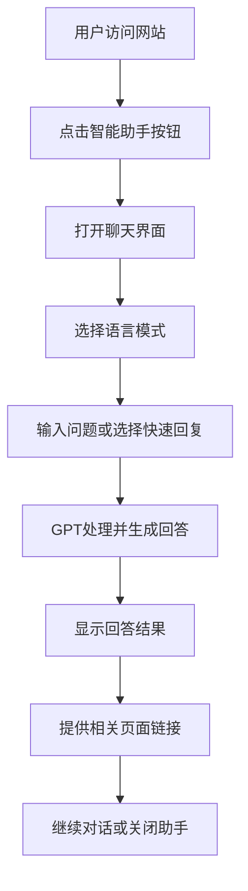

# GPT智能助手功能产品需求文档

## 1. 产品概述

为牟昭阳个人学术网站设计一个基于GPT的智能助手功能，为访问者提供实时的学术咨询、内容导航和个人信息查询服务。该助手将作为网站的智能交互入口，帮助用户更好地了解牟昭阳的学术背景、研究方向和项目经验。

- 解决访问者快速获取相关信息的需求，提供个性化的学术交流体验
- 目标用户：学术同行、潜在合作伙伴、招聘方、学生等
- 提升网站的交互性和用户体验，展现技术实力和创新能力

## 2. 核心功能

### 2.1 用户角色
本功能面向所有网站访问者，无需区分用户角色，提供统一的智能助手服务。

### 2.2 功能模块
智能助手功能包含以下核心页面和组件：

1. **智能聊天界面**：浮动聊天窗口，支持实时对话交互
2. **知识库管理**：基于网站内容的智能问答系统
3. **对话历史**：用户会话记录和上下文维护
4. **快速操作**：预设问题和快捷回复功能

### 2.3 页面详情

| 页面名称 | 模块名称 | 功能描述 |
|----------|----------|----------|
| 智能聊天界面 | 聊天窗口 | 提供实时对话界面，支持文本输入、消息显示、打字动画效果 |
| 智能聊天界面 | 快速回复 | 提供预设问题选项，如"研究方向"、"项目经验"、"联系方式"等 |
| 智能聊天界面 | 语言切换 | 支持中英文对话模式切换，与网站主题保持一致 |
| 知识库管理 | 内容解析 | 自动解析网站内容，构建个人信息知识库 |
| 知识库管理 | 智能问答 | 基于GPT API提供准确的个人信息回答 |
| 对话历史 | 会话记录 | 保存用户对话历史，支持会话恢复 |
| 对话历史 | 上下文维护 | 维持对话连续性，理解上下文关联 |

## 3. 核心流程

用户访问网站后，可以通过浮动的智能助手按钮开启对话。助手能够回答关于牟昭阳的学术背景、研究项目、技能专长等问题，并提供相关页面导航。对话支持中英文切换，维持上下文连续性。

## 4. 用户界面设计

### 4.1 设计风格
- 主色调：与网站主题保持一致的深蓝色系（#1e40af, #3b82f6）
- 按钮风格：圆形浮动按钮，带有微妙的阴影和悬停效果
- 字体：与网站统一的现代无衬线字体
- 布局风格：卡片式聊天界面，简洁现代的对话气泡设计
- 图标风格：使用Heroicons图标库，保持视觉一致性

### 4.2 页面设计概览

| 页面名称 | 模块名称 | UI元素 |
|----------|----------|--------|
| 智能聊天界面 | 浮动按钮 | 右下角圆形按钮，GPT图标，蓝色渐变背景，悬停放大效果 |
| 智能聊天界面 | 聊天窗口 | 卡片式弹窗，白色背景，圆角边框，阴影效果，最大高度500px |
| 智能聊天界面 | 消息气泡 | 用户消息右对齐蓝色背景，助手消息左对齐灰色背景，圆角设计 |
| 智能聊天界面 | 输入框 | 底部固定输入区域，发送按钮，字符计数显示 |
| 智能聊天界面 | 快速回复 | 预设问题按钮，浅蓝色背景，点击高亮效果 |

### 4.3 响应式设计
- 桌面端：聊天窗口固定在右下角，宽度350px，高度500px
- 移动端：全屏聊天界面，适配触摸操作，优化输入体验
- 平板端：适中尺寸的聊天窗口，保持良好的可用性

## 5. 技术特性

### 5.1 智能问答能力
- 基于网站内容训练的专业知识库
- 支持学术背景、研究方向、项目经验等领域问答
- 提供CFD、机器学习、水下机器人等技术咨询

### 5.2 多语言支持
- 中英文对话切换
- 与网站国际化系统集成
- 智能语言检测和回复

### 5.3 用户体验优化
- 实时打字动画效果
- 智能加载状态显示
- 优雅的进入和退出动画
- 对话历史本地存储

### 5.4 安全性保障
- API密钥安全存储
- 用户隐私保护
- 对话内容过滤
- 访问频率限制