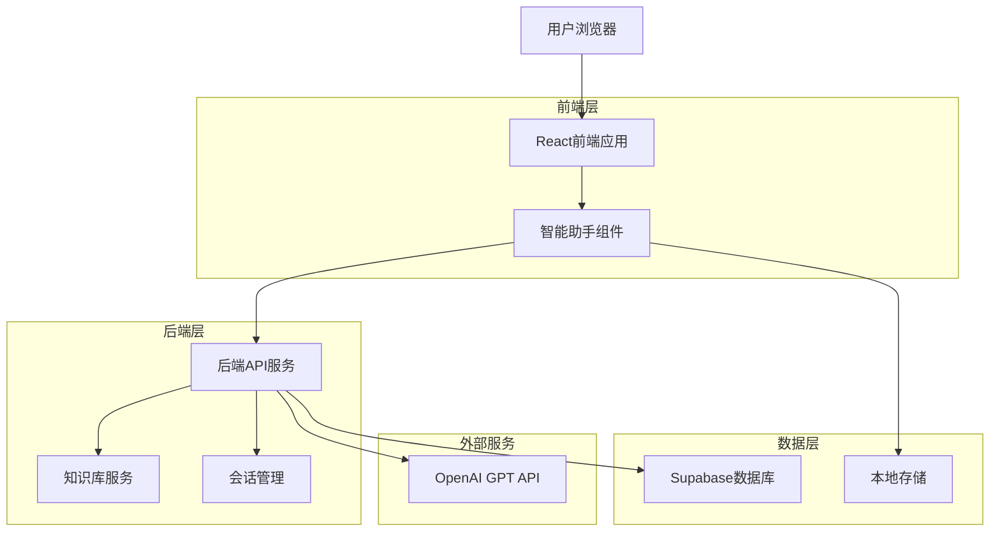
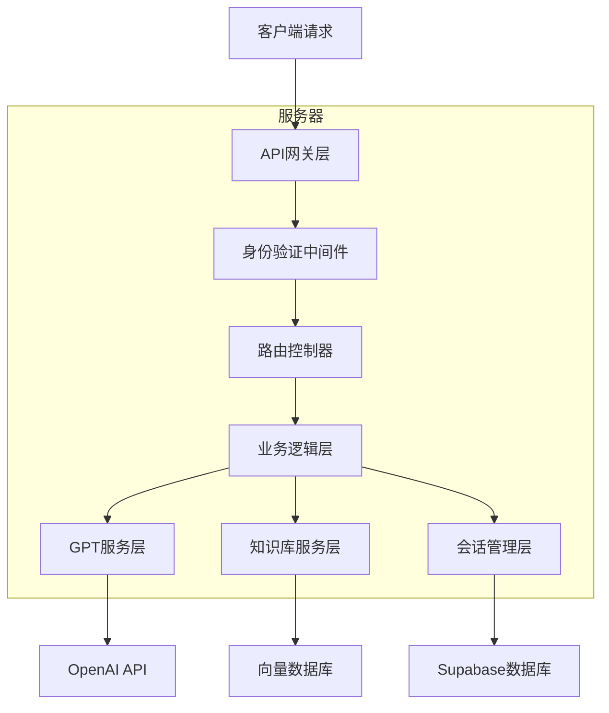
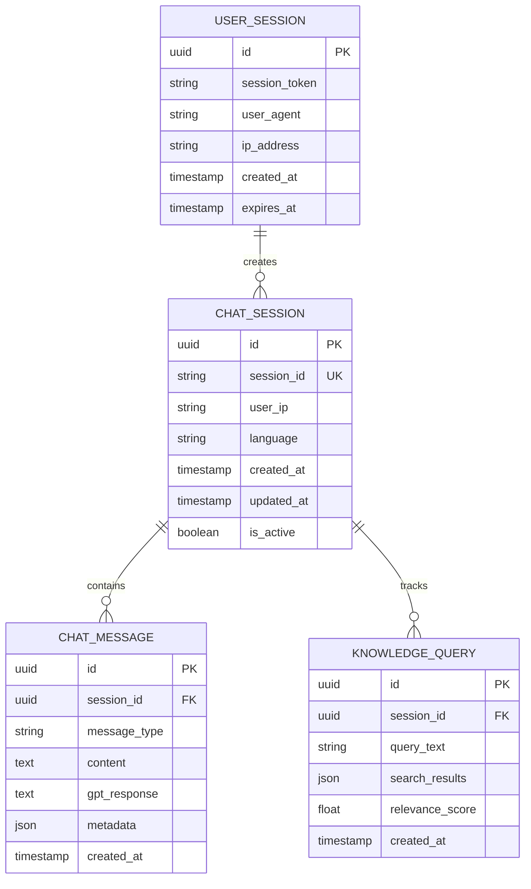

# GPT智能助手技术架构文档

## 1. 架构设计



## 2. 技术描述

* 前端：React\@18 + TypeScript + Tailwind CSS + Framer Motion

* 后端：Express.js + Node.js

* 数据库：Supabase (PostgreSQL)

* 外部API：OpenAI GPT-4 API

* 状态管理：React Context + useState/useReducer

* 实时通信：WebSocket (可选) 或 HTTP轮询

## 3. 路由定义

| 路由             | 用途              |
| -------------- | --------------- |
| /chat          | 智能助手聊天界面（组件级路由） |
| /api/chat      | 后端聊天API接口       |
| /api/knowledge | 知识库查询接口         |
| /api/sessions  | 会话管理接口          |

## 4. API定义

### 4.1 核心API

智能助手聊天接口

```
POST /api/chat/message
```

Request:

| 参数名       | 参数类型   | 是否必需  | 描述               |
| --------- | ------ | ----- | ---------------- |
| message   | string | true  | 用户输入的消息内容        |
| sessionId | string | true  | 会话唯一标识符          |
| language  | string | false | 对话语言（zh/en），默认zh |
| context   | array  | false | 上下文消息历史          |

Response:

| 参数名          | 参数类型   | 描述         |
| ------------ | ------ | ---------- |
| reply        | string | GPT生成的回复内容 |
| sessionId    | string | 会话标识符      |
| timestamp    | string | 回复时间戳      |
| relatedLinks | array  | 相关页面链接推荐   |

示例：

```json
{
  "message": "请介绍一下牟昭阳的研究方向",
  "sessionId": "sess_123456",
  "language": "zh"
}
```

Response:

```json
{
  "reply": "牟昭阳的主要研究方向包括科学计算和机器人技术，特别专注于使用Transformer和Neural Operator建模CFD时空场...",
  "sessionId": "sess_123456",
  "timestamp": "2025-01-27T10:30:00Z",
  "relatedLinks": [
    {"title": "研究页面", "url": "/research"},
    {"title": "项目展示", "url": "/projects"}
  ]
}
```

### 4.2 会话管理API

创建新会话

```
POST /api/sessions/create
```

获取会话历史

```
GET /api/sessions/{sessionId}/history
```

### 4.3 知识库API

查询知识库内容

```
GET /api/knowledge/search?query={query}&lang={language}
```

## 5. 服务器架构图



## 6. 数据模型

### 6.1 数据模型定义



### 6.2 数据定义语言

聊天会话表 (chat\_sessions)

```sql
-- 创建聊天会话表
CREATE TABLE chat_sessions (
    id UUID PRIMARY KEY DEFAULT gen_random_uuid(),
    session_id VARCHAR(255) UNIQUE NOT NULL,
    user_ip INET,
    language VARCHAR(10) DEFAULT 'zh' CHECK (language IN ('zh', 'en')),
    created_at TIMESTAMP WITH TIME ZONE DEFAULT NOW(),
    updated_at TIMESTAMP WITH TIME ZONE DEFAULT NOW(),
    is_active BOOLEAN DEFAULT true
);

-- 创建聊天消息表
CREATE TABLE chat_messages (
    id UUID PRIMARY KEY DEFAULT gen_random_uuid(),
    session_id UUID REFERENCES chat_sessions(id) ON DELETE CASCADE,
    message_type VARCHAR(20) NOT NULL CHECK (message_type IN ('user', 'assistant')),
    content TEXT NOT NULL,
    gpt_response TEXT,
    metadata JSONB DEFAULT '{}',
    created_at TIMESTAMP WITH TIME ZONE DEFAULT NOW()
);

-- 创建知识库查询表
CREATE TABLE knowledge_queries (
    id UUID PRIMARY KEY DEFAULT gen_random_uuid(),
    session_id UUID REFERENCES chat_sessions(id) ON DELETE CASCADE,
    query_text TEXT NOT NULL,
    search_results JSONB DEFAULT '[]',
    relevance_score FLOAT DEFAULT 0.0,
    created_at TIMESTAMP WITH TIME ZONE DEFAULT NOW()
);

-- 创建用户会话表
CREATE TABLE user_sessions (
    id UUID PRIMARY KEY DEFAULT gen_random_uuid(),
    session_token VARCHAR(255) UNIQUE NOT NULL,
    user_agent TEXT,
    ip_address INET,
    created_at TIMESTAMP WITH TIME ZONE DEFAULT NOW(),
    expires_at TIMESTAMP WITH TIME ZONE DEFAULT (NOW() + INTERVAL '24 hours')
);

-- 创建索引
CREATE INDEX idx_chat_sessions_session_id ON chat_sessions(session_id);
CREATE INDEX idx_chat_messages_session_id ON chat_messages(session_id);
CREATE INDEX idx_chat_messages_created_at ON chat_messages(created_at DESC);
CREATE INDEX idx_knowledge_queries_session_id ON knowledge_queries(session_id);
CREATE INDEX idx_user_sessions_token ON user_sessions(session_token);
CREATE INDEX idx_user_sessions_expires ON user_sessions(expires_at);

-- 设置行级安全策略
ALTER TABLE chat_sessions ENABLE ROW LEVEL SECURITY;
ALTER TABLE chat_messages ENABLE ROW LEVEL SECURITY;
ALTER TABLE knowledge_queries ENABLE ROW LEVEL SECURITY;

-- 允许匿名用户创建和查询自己的会话
CREATE POLICY "Allow anonymous chat sessions" ON chat_sessions
    FOR ALL USING (true);

CREATE POLICY "Allow anonymous chat messages" ON chat_messages
    FOR ALL USING (true);

CREATE POLICY "Allow anonymous knowledge queries" ON knowledge_queries
    FOR ALL USING (true);

-- 授权
GRANT ALL PRIVILEGES ON chat_sessions TO anon;
GRANT ALL PRIVILEGES ON chat_messages TO anon;
GRANT ALL PRIVILEGES ON knowledge_queries TO anon;
GRANT ALL PRIVILEGES ON user_sessions TO anon;

-- 初始化数据
INSERT INTO chat_sessions (session_id, language, user_ip) VALUES
('demo_session_zh', 'zh', '127.0.0.1'),
('demo_session_en', 'en', '127.0.0.1');

INSERT INTO chat_messages (session_id, message_type, content, gpt_response) VALUES
((SELECT id FROM chat_sessions WHERE session_id = 'demo_session_zh'), 'user', '你好，请介绍一下牟昭阳', '您好！牟昭阳是一位专注于科学计算和机器人技术的研究者，目前在大连海事大学攻读人工智能专业硕士学位，同时在西湖大学工学院担任访问学生。他的研究方向主要包括使用Transformer和Neural Operator建模CFD时空场，以及水下机器人仿生感知技术。'),
((SELECT id FROM chat_sessions WHERE session_id = 'demo_session_en'), 'user', 'Hello, can you introduce Zhaoyang Mou?', 'Hello! Zhaoyang Mou is a researcher focused on scientific computing and robotics. He is currently pursuing a Master''s degree in Artificial Intelligence at Dalian Maritime University and serves as a visiting student at the School of Engineering, Westlake University. His research interests include modeling CFD spatiotemporal fields using Transformers and Neural Operators, as well as bionic perception technology for underwater robots.');
```

## 7. 组件架构

### 7.1 前端组件结构

```
src/components/ChatAssistant/
├── ChatAssistant.tsx          # 主聊天助手组件
├── ChatButton.tsx             # 浮动聊天按钮
├── ChatWindow.tsx             # 聊天窗口容器
├── MessageBubble.tsx          # 消息气泡组件
├── MessageInput.tsx           # 消息输入框
├── QuickReplies.tsx           # 快速回复按钮
├── TypingIndicator.tsx        # 打字指示器
├── ChatHistory.tsx            # 聊天历史
└── LanguageSelector.tsx       # 语言选择器
```

### 7.2 后端服务结构

```
src/services/chat/
├── chatController.js          # 聊天控制器
├── gptService.js             # GPT API服务
├── knowledgeService.js       # 知识库服务
├── sessionService.js         # 会话管理服务
├── messageProcessor.js       # 消息处理器
└── responseFormatter.js      # 响应格式化器
```

## 8. 安全性设计

### 8.1 API安全

* OpenAI API密钥存储在环境变量中

* 实施请求频率限制（每分钟最多10次请求）

* 输入内容过滤和验证

* CORS策略配置

### 8.2 数据安全

* 用户IP地址哈希存储

* 会话数据定期清理（7天后自动删除）

* 敏感信息脱敏处理

* HTTPS强制加密传输

### 8.3 隐私保护

* 不收集用户个人身份信息

* 对话内容仅用于改善服务质量

* 提供数据删除选项

* 遵循GDPR和相关隐私法规

