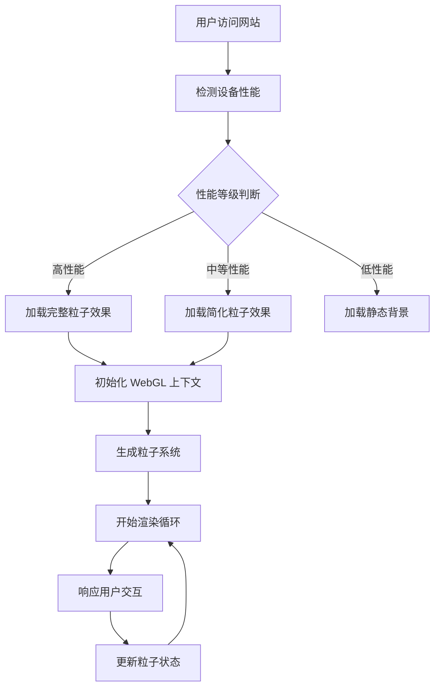

# Particle Field 粒子海洋功能产品需求文档

## 1. 产品概述

基于 WebGL 技术构建的动态粒子海洋效果，通过 Perlin Noise 算法和后处理技术创造沉浸式的视觉体验。该功能将作为个人网站的核心视觉元素，呼应"比特"概念，展现数字化时代的美学特征。

- 核心目标：为个人网站提供独特的视觉标识，通过动态粒子效果展现技术实力和创新思维
- 用户价值：提升网站的视觉吸引力和用户停留时间，创造难忘的第一印象

## 2. 核心功能

### 2.1 用户角色

| 角色 | 访问方式 | 核心权限 |
|------|----------|----------|
| 网站访客 | 直接访问 | 观看粒子效果、基础交互操作 |
| 网站管理员 | 管理后台 | 调整粒子参数、切换显示模式 |

### 2.2 功能模块

我们的 Particle Field 功能包含以下主要模块：

1. **粒子海洋展示页面**：主要的粒子效果展示区域，支持全屏沉浸式体验
2. **交互控制面板**：用户可调节粒子参数的控制界面
3. **性能监控面板**：实时显示渲染性能指标
4. **设置配置页面**：管理员配置粒子系统参数的后台界面

### 2.3 页面详情

| 页面名称 | 模块名称 | 功能描述 |
|----------|----------|----------|
| 粒子海洋展示页面 | WebGL 渲染器 | 初始化 WebGL 上下文，设置渲染管线，管理着色器程序 |
| 粒子海洋展示页面 | 粒子系统 | 生成和管理粒子生命周期，应用 Perlin Noise 算法控制粒子运动 |
| 粒子海洋展示页面 | 后处理效果 | 应用模糊、发光、色彩校正等后处理效果增强视觉表现 |
| 粒子海洋展示页面 | 交互响应 | 响应鼠标移动、点击、触摸等用户交互，动态调整粒子行为 |
| 交互控制面板 | 参数调节器 | 提供滑块、按钮等控件调节粒子数量、速度、颜色等参数 |
| 交互控制面板 | 预设管理 | 保存和加载不同的粒子效果预设配置 |
| 性能监控面板 | FPS 计数器 | 实时显示帧率和渲染性能指标 |
| 性能监控面板 | 资源监控 | 监控 GPU 内存使用和渲染调用次数 |
| 设置配置页面 | 全局设置 | 配置默认粒子参数、性能优化选项、主题适配 |

## 3. 核心流程

**用户访问流程：**
用户进入网站 → 粒子系统自动初始化 → 检测设备性能 → 加载适配的粒子配置 → 开始渲染粒子效果 → 响应用户交互

**管理员配置流程：**
管理员登录 → 进入设置页面 → 调整粒子参数 → 预览效果 → 保存配置 → 应用到前台展示

## 4. 用户界面设计

### 4.1 设计风格

- **主色调**：深蓝色 (#0a0f1c) 到青色 (#00d4ff) 的渐变，呼应数字海洋概念
- **辅助色**：白色 (#ffffff) 用于控制面板，半透明黑色 (#000000aa) 用于遮罩
- **按钮样式**：圆角矩形，支持悬停发光效果，与粒子主题保持一致
- **字体**：主要使用 'Inter' 字体，代码相关使用 'JetBrains Mono'
- **布局风格**：极简主义设计，控制面板采用浮动卡片式布局
- **图标风格**：线性图标，支持动画过渡效果

### 4.2 页面设计概览

| 页面名称 | 模块名称 | UI 元素 |
|----------|----------|---------|
| 粒子海洋展示页面 | 全屏画布 | 占满整个视口的 WebGL 画布，支持响应式缩放 |
| 粒子海洋展示页面 | 浮动控制栏 | 半透明背景，包含播放/暂停、全屏、设置等按钮 |
| 交互控制面板 | 参数面板 | 滑块控件使用渐变色轨道，实时预览参数变化效果 |
| 交互控制面板 | 预设选择器 | 卡片式预设展示，支持缩略图预览 |
| 性能监控面板 | 数据图表 | 实时折线图显示 FPS 变化，使用绿色到红色的渐变表示性能状态 |

### 4.3 响应式设计

- **桌面优先**：主要针对桌面端体验优化，充分利用大屏幕空间
- **移动端适配**：自动降低粒子数量和效果复杂度，优化触摸交互
- **性能自适应**：根据设备性能动态调整渲染质量和粒子数量