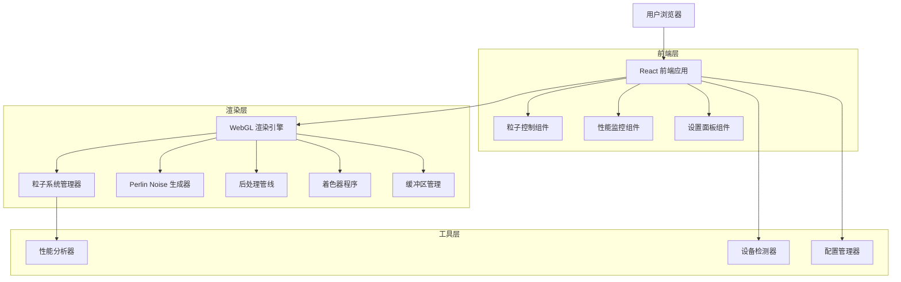
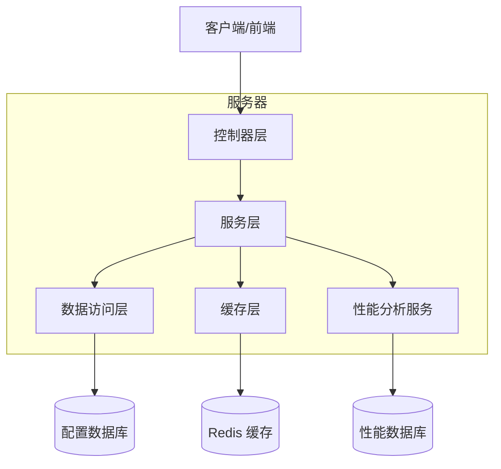
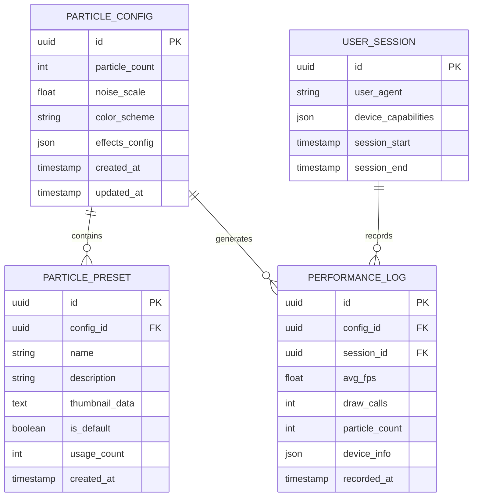

# Particle Field 粒子海洋技术架构文档

## 1. 架构设计



## 2. 技术描述

* 前端：React\@18 + TypeScript + Tailwind CSS + Vite

* 渲染引擎：原生 WebGL 2.0 + 自定义着色器

* 数学库：自实现 Perlin Noise + 向量数学工具

* 性能优化：Web Workers + 对象池 + LOD 系统

* 状态管理：Zustand（轻量级状态管理）

## 3. 路由定义

| 路由                       | 用途                   |
| ------------------------ | -------------------- |
| /particle-field          | 粒子海洋主展示页面，全屏沉浸式体验    |
| /particle-field/demo     | 粒子效果演示页面，包含控制面板和参数调节 |
| /particle-field/settings | 粒子系统配置页面，管理员后台设置     |

## 4. API 定义

### 4.1 核心 API

粒子系统配置相关

```
GET /api/particle/config
```

Response:

| 参数名称             | 参数类型   | 描述                     |
| ---------------- | ------ | ---------------------- |
| particleCount    | number | 粒子数量                   |
| noiseScale       | number | Perlin Noise 缩放因子      |
| colorScheme      | string | 颜色方案标识                 |
| performanceLevel | string | 性能等级 (high/medium/low) |

示例

```json
{
  "particleCount": 50000,
  "noiseScale": 0.005,
  "colorScheme": "ocean",
  "performanceLevel": "high",
  "effects": {
    "bloom": true,
    "blur": 0.8,
    "contrast": 1.2
  }
}
```

粒子预设管理

```
POST /api/particle/presets
```

Request:

| 参数名称      | 参数类型   | 是否必需  | 描述           |
| --------- | ------ | ----- | ------------ |
| name      | string | true  | 预设名称         |
| config    | object | true  | 粒子配置对象       |
| thumbnail | string | false | 预设缩略图 Base64 |

性能监控数据

```
POST /api/particle/performance
```

Request:

| 参数名称          | 参数类型   | 是否必需 | 描述     |
| ------------- | ------ | ---- | ------ |
| fps           | number | true | 平均帧率   |
| drawCalls     | number | true | 渲染调用次数 |
| particleCount | number | true | 当前粒子数量 |
| deviceInfo    | object | true | 设备信息   |

## 5. 服务器架构图



## 6. 数据模型

### 6.1 数据模型定义



### 6.2 数据定义语言

粒子配置表 (particle\_configs)

```sql
-- 创建表
CREATE TABLE particle_configs (
    id UUID PRIMARY KEY DEFAULT gen_random_uuid(),
    particle_count INTEGER NOT NULL DEFAULT 10000,
    noise_scale FLOAT NOT NULL DEFAULT 0.005,
    color_scheme VARCHAR(50) NOT NULL DEFAULT 'ocean',
    effects_config JSONB NOT NULL DEFAULT '{}',
    performance_level VARCHAR(20) NOT NULL DEFAULT 'medium' CHECK (performance_level IN ('low', 'medium', 'high')),
    is_active BOOLEAN DEFAULT true,
    created_at TIMESTAMP WITH TIME ZONE DEFAULT NOW(),
    updated_at TIMESTAMP WITH TIME ZONE DEFAULT NOW()
);

-- 创建索引
CREATE INDEX idx_particle_configs_performance_level ON particle_configs(performance_level);
CREATE INDEX idx_particle_configs_active ON particle_configs(is_active);
CREATE INDEX idx_particle_configs_created_at ON particle_configs(created_at DESC);

-- 初始化数据
INSERT INTO particle_configs (particle_count, noise_scale, color_scheme, effects_config, performance_level) VALUES
(50000, 0.005, 'ocean', '{"bloom": true, "blur": 0.8, "contrast": 1.2}', 'high'),
(25000, 0.008, 'ocean', '{"bloom": true, "blur": 0.6, "contrast": 1.0}', 'medium'),
(10000, 0.01, 'ocean', '{"bloom": false, "blur": 0.3, "contrast": 0.8}', 'low');
```

粒子预设表 (particle\_presets)

```sql
-- 创建表
CREATE TABLE particle_presets (
    id UUID PRIMARY KEY DEFAULT gen_random_uuid(),
    config_id UUID REFERENCES particle_configs(id) ON DELETE CASCADE,
    name VARCHAR(100) NOT NULL,
    description TEXT,
    thumbnail_data TEXT,
    is_default BOOLEAN DEFAULT false,
    usage_count INTEGER DEFAULT 0,
    created_at TIMESTAMP WITH TIME ZONE DEFAULT NOW()
);

-- 创建索引
CREATE INDEX idx_particle_presets_config_id ON particle_presets(config_id);
CREATE INDEX idx_particle_presets_default ON particle_presets(is_default);
CREATE INDEX idx_particle_presets_usage ON particle_presets(usage_count DESC);

-- 初始化数据
INSERT INTO particle_presets (config_id, name, description, is_default) VALUES
((SELECT id FROM particle_configs WHERE performance_level = 'high' LIMIT 1), '深海漩涡', '高性能设备的完整粒子效果', true),
((SELECT id FROM particle_configs WHERE performance_level = 'medium' LIMIT 1), '数字波浪', '中等性能设备的平衡效果', false),
((SELECT id FROM particle_configs WHERE performance_level = 'low' LIMIT 1), '简约粒子', '低性能设备的优化效果', false);
```

性能日志表 (performance\_logs)

```sql
-- 创建表
CREATE TABLE performance_logs (
    id UUID PRIMARY KEY DEFAULT gen_random_uuid(),
    config_id UUID REFERENCES particle_configs(id),
    session_id UUID REFERENCES user_sessions(id),
    avg_fps FLOAT NOT NULL,
    draw_calls INTEGER NOT NULL,
    particle_count INTEGER NOT NULL,
    device_info JSONB NOT NULL,
    recorded_at TIMESTAMP WITH TIME ZONE DEFAULT NOW()
);

-- 创建索引
CREATE INDEX idx_performance_logs_config_id ON performance_logs(config_id);
CREATE INDEX idx_performance_logs_session_id ON performance_logs(session_id);
CREATE INDEX idx_performance_logs_recorded_at ON performance_logs(recorded_at DESC);
CREATE INDEX idx_performance_logs_fps ON performance_logs(avg_fps);

-- 创建分区表（按月分区）
CREATE TABLE performance_logs_y2024m01 PARTITION OF performance_logs
FOR VALUES FROM ('2024-01-01') TO ('2024-02-01');
```

用户会话表 (user\_sessions)

```sql
-- 创建表
CREATE TABLE user_sessions (
    id UUID PRIMARY KEY DEFAULT gen_random_uuid(),
    user_agent TEXT,
    device_capabilities JSONB NOT NULL DEFAULT '{}',
    session_start TIMESTAMP WITH TIME ZONE DEFAULT NOW(),
    session_end TIMESTAMP WITH TIME ZONE,
    total_duration INTERVAL GENERATED ALWAYS AS (session_end - session_start) STORED
);

-- 创建索引
CREATE INDEX idx_user_sessions_start ON user_sessions(session_start DESC);
CREATE INDEX idx_user_sessions_duration ON user_sessions(total_duration DESC);
```

