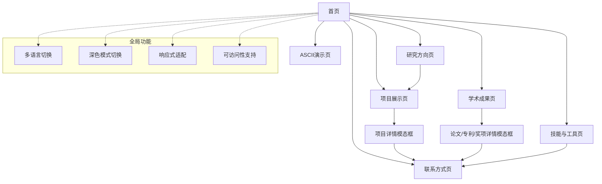

# 牟昭阳个人网站产品需求文档

## 1. Product Overview
牟昭阳个人学术网站是一个现代化的个人展示平台，专门为科学计算与机器人领域的研究者设计。
- 主要目的：展示牟昭阳在CFD仿真、机器学习、水下机器人等领域的研究成果和技术能力，为学术合作和职业发展提供专业展示平台。
- 目标用户：学术同行、潜在合作伙伴、招聘方、学生等对其研究领域感兴趣的专业人士。
- 技术特色：基于React 18 + TypeScript的现代化单页应用，支持多语言切换、深色模式、响应式设计和可访问性优化。

## 2. Core Features

### 2.1 Feature Module
我们的个人网站包含以下主要页面：
1. **首页 (Home)**：个人介绍、研究亮点展示、最新动态、统计数据
2. **研究方向页 (Research)**：详细介绍科学计算和机器人研究领域
3. **项目展示页 (Projects)**：核心项目详情、技术栈、成果展示、高级搜索筛选
4. **学术成果页 (Publications)**：论文发表、专利申请、奖项展示、详情模态框
5. **技能与工具页 (Skills)**：技术能力矩阵、工具熟练度展示、雷达图可视化
6. **联系方式页 (Contact)**：联系信息、合作意向表单
7. **ASCII演示页 (ASCIIDemo)**：创意ASCII艺术展示

### 2.2 Page Details

| Page Name | Module Name | Feature description |
|-----------|-------------|---------------------|
| 首页 | Hero Section | 展示个人头像、姓名、研究领域标签，包含动态ASCII背景效果 |
| 首页 | 研究亮点 | 轮播展示3个核心研究成果（DamFormer、稀疏到稠密重建、仿生波动鳍），包含项目缩略图和简介 |
| 首页 | 最新动态 | 显示最近的论文发表、专利申请、项目进展等时间线，支持多语言 |
| 首页 | 统计数据 | 展示论文数量(10+)、项目数量(5)、专利数量(8)、奖项数量(3+) |
| 研究方向页 | 科学计算模块 | 详细介绍Transformer/Neural Operator建模CFD时空场研究 |
| 研究方向页 | 机器人研究模块 | 展示水下机器人仿生感知、TENG/人工侧线等研究内容 |
| 研究方向页 | 技术能力展示 | 列出Star-CCM+、COMSOL、ANSYS等仿真软件能力 |
| 项目展示页 | 项目卡片 | 展示DamFormer、稀疏到稠密Transformer、仿生机器人等6个核心项目 |
| 项目展示页 | 项目详情 | 包含项目背景、技术方案、实现效果、相关论文链接、GitHub链接 |
| 项目展示页 | 高级搜索筛选 | 按研究领域、状态、年份等维度筛选，支持关键词搜索和排序 |
| 学术成果页 | 论文列表 | 展示Physics of Fluids、IEEE RA-L等期刊论文，支持搜索筛选 |
| 学术成果页 | 专利展示 | 列出8项专利申请，包含专利号、申请时间、技术领域 |
| 学术成果页 | 奖项展示 | 展示学术竞赛获奖情况和荣誉 |
| 学术成果页 | 详情模态框 | 点击查看论文/专利/奖项的详细信息，支持多语言 |
| 技能与工具页 | 技能矩阵 | 雷达图展示编程、仿真、AI/ML、硬件、工具等5大类技能 |
| 技能与工具页 | 工具展示 | 分类展示CFD仿真、机械设计、深度学习等工具熟练度，包含项目案例 |
| 联系方式页 | 联系信息 | 显示电话、邮箱、学术社交媒体链接 |
| 联系方式页 | 合作表单 | 提供在线联系表单，支持合作意向提交 |
| ASCII演示页 | ASCII艺术 | 展示创意ASCII文字艺术和动画效果 |
| 全局功能 | 多语言支持 | 中英文双语切换，智能翻译服务集成 |
| 全局功能 | 深色模式 | 支持浅色/深色/系统主题切换 |
| 全局功能 | 响应式设计 | 适配桌面端、平板端、移动端 |
| 全局功能 | 可访问性 | 支持屏幕阅读器、键盘导航、高对比度模式 |
| 全局功能 | 性能优化 | 懒加载、代码分割、图片优化、缓存策略 |

## 3. Core Process

**访客浏览流程：**
用户进入首页了解基本信息 → 通过导航进入感兴趣的研究方向页面 → 查看具体项目详情 → 浏览学术成果和技能展示 → 通过联系页面建立联系

**学术展示流程：**
研究亮点展示 → 详细项目介绍 → 相关论文和专利 → 技术能力证明 → 合作联系

**多语言体验流程：**
检测浏览器语言 → 自动设置默认语言 → 用户可手动切换中英文 → 实时翻译页面内容 → 保存语言偏好

## 4. User Interface Design

### 4.1 Design Style
- **主色调**：深蓝色(#1e3a8a)和科技蓝(#3b82f6)，体现科研专业性
- **辅助色**：白色(#ffffff)、浅灰(#f8fafc)、橙色(#f59e0b)作为强调色
- **按钮样式**：圆角矩形，渐变背景，悬停动效
- **字体**：中文使用思源黑体，英文使用Inter，代码使用JetBrains Mono
- **布局风格**：现代卡片式设计，响应式网格布局
- **图标风格**：线性图标配合实心图标，统一使用Heroicons图标库

### 4.2 Page Design Overview

| Page Name | Module Name | UI Elements |
|-----------|-------------|-------------|
| 首页 | Hero Section | 全屏渐变背景，居中头像(圆形，120px)，大标题(32px)，研究领域标签 |
| 首页 | 研究亮点 | 3列卡片布局，悬停放大效果，渐变边框，项目缩略图(300x200px) |
| 首页 | 最新动态 | 垂直时间线设计，左侧时间点，右侧内容卡片，交替布局 |
| 研究方向页 | 内容模块 | 双栏布局，左侧文字描述，右侧配图或图表，分割线分隔 |
| 项目展示页 | 项目卡片 | 网格布局(3列)，卡片阴影效果，标签分类，悬停显示详情按钮 |
| 学术成果页 | 论文列表 | 表格式布局，可排序，搜索框，分页器，期刊影响因子标识 |
| 技能与工具页 | 技能矩阵 | 雷达图可视化，进度条展示，分类标签，技能等级颜色编码 |
| 联系方式页 | 联系表单 | 单栏居中布局，输入框圆角设计，提交按钮渐变效果 |

### 4.3 Responsiveness
网站采用移动优先的响应式设计，支持桌面端(1200px+)、平板端(768px-1199px)和移动端(<768px)。移动端优化触摸交互，增大点击区域，简化导航结构。