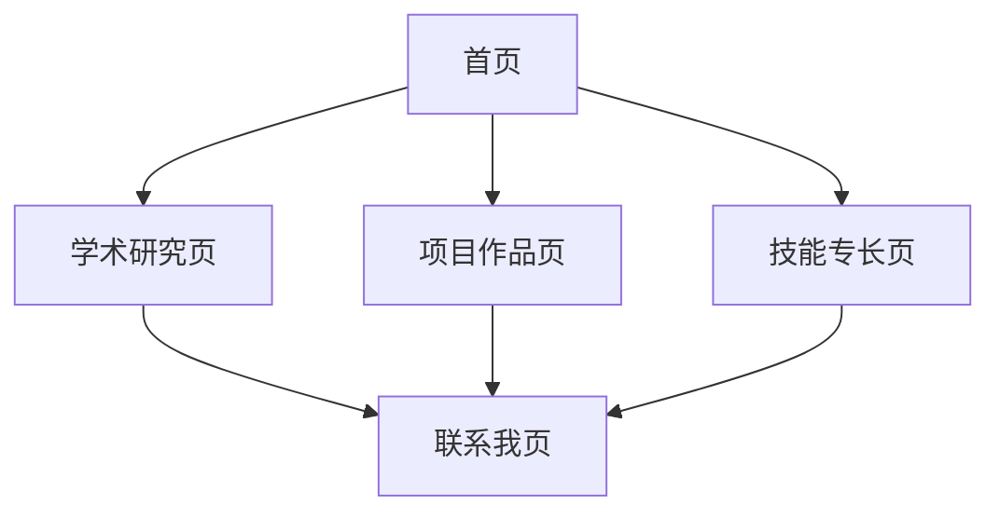

# 牟昭阳个人学术网站产品需求文档

## 1. 产品概述

牟昭阳个人学术网站是一个展示科研成果、学术经历和技术能力的专业平台。网站主要面向学术界同行、潜在合作伙伴、招聘方以及对科学计算和机器人技术感兴趣的访问者。

网站旨在全面展示牟昭阳在科学计算、机器人技术和人工智能交叉领域的研究成果，包括最新的DamFormer论文、专利成果以及正在进行的Sparse→Dense Transformer项目。

目标是建立专业的学术形象，促进学术交流与合作，并为未来的职业发展提供有力支撑。

## 2. 核心功能

### 2.1 用户角色

由于是个人学术展示网站，不需要复杂的用户角色区分，所有访问者均为匿名用户，具有浏览权限。

### 2.2 功能模块

网站包含以下核心页面：

1. **首页**：个人介绍、研究亮点展示、最新动态、统计数据展示
2. **学术研究页**：论文发表、专利申请、获奖荣誉的详细展示
3. **项目作品页**：重点项目展示，包括DamFormer、Sparse→Dense Transformer等
4. **技能专长页**：技术栈、工具使用、专业能力展示
5. **联系我页**：联系方式、合作意向表单

### 2.3 页面详情

| 页面名称  | 模块名称 | 功能描述                                                                                                      |
| ----- | ---- | --------------------------------------------------------------------------------------------------------- |
| 首页    | 英雄区块 | 展示个人头像、姓名（中英文）、当前身份（大连海事大学硕士在读、西湖大学访问学生）、研究方向简介                                                           |
| 首页    | 研究亮点 | 轮播展示DamFormer、Sparse→Dense Transformer、仿生波动鳍推进等核心项目                                                       |
| 首页    | 最新动态 | 展示Physics of Fluids论文接收、IEEE RA-L发表、专利获批等最新成果                                                             |
| 首页    | 统计数据 | 显示论文数量（10+篇）、专利数量（8项）、项目数量（5个）、获奖数量（3+项）                                                                  |
| 学术研究页 | 论文发表 | 详细展示已发表和在审论文，包括Physics of Fluids、IEEE RA-L、Advanced Materials Technologies等                               |
| 学术研究页 | 专利申请 | 展示8项专利，包括水下机器人相关专利（CN119509546A等）                                                                         |
| 学术研究页 | 获奖荣誉 | 展示互联网+金奖、机械创新设计大赛一等奖、RoboCup一等奖等                                                                          |
| 项目作品页 | 项目展示 | DamFormer（溃坝仿真Transformer）、Sparse→Dense Transformer、仿生波动鳍推进、风扇阵列风洞、海洋观测浮标                                 |
| 技能专长页 | 技术栈  | Python（PyTorch/NumPy/Pandas）、Java（Star-CCM+ Macro）、CFD仿真（Star-CCM+/COMSOL/ANSYS）、机械设计（SolidWorks/Shapr3D） |
| 联系我页  | 联系信息 | 邮箱（<mzymuzhaoyang@gmail.com>）、电话（+86 153 8213 0266）、Google Scholar、GitHub、LinkedIn                        |

## 3. 核心流程

用户主要操作流程如下：

**访问者浏览流程：**
首页了解基本信息 → 学术研究页查看成果 → 项目作品页了解技术能力 → 联系我页获取联系方式

**学术合作流程：**
首页研究亮点 → 学术研究页详细成果 → 技能专长页技术匹配 → 联系我页建立联系

## 4. 用户界面设计

### 4.1 设计风格

* **主色调**：蓝色系（#3B82F6）和紫色系（#8B5CF6），体现科技感和学术专业性

* **辅助色**：灰色系（#6B7280、#9CA3AF）用于文本和背景

* **按钮风格**：圆角矩形，支持悬停效果和渐变背景

* **字体**：中文使用系统默认字体，英文使用Inter或类似现代字体

* **布局风格**：卡片式设计，顶部导航，响应式布局

* **图标风格**：线性图标，简洁现代

### 4.2 页面设计概览

| 页面名称  | 模块名称 | UI元素                        |
| ----- | ---- | --------------------------- |
| 首页    | 英雄区块 | 渐变背景、个人头像（圆形）、大标题、标签云、CTA按钮 |
| 首页    | 研究亮点 | 轮播卡片、项目图片、描述文本、分类标签、指示器     |
| 首页    | 最新动态 | 时间线布局、日期标签、标题、描述、类型图标       |
| 首页    | 统计数据 | 深色背景、数字突出显示、图标、描述文字         |
| 学术研究页 | 成果展示 | 筛选器、搜索框、卡片网格、详情模态框          |
| 项目作品页 | 项目卡片 | 项目封面、技术标签、GitHub链接、演示链接     |
| 技能专长页 | 技能分类 | 进度条、技能图标、熟练度显示、相关项目链接       |
| 联系我页  | 联系表单 | 输入框、文本域、提交按钮、社交媒体链接         |

### 4.3 响应式设计

网站采用移动优先的响应式设计：

* **桌面端**：多列布局，丰富的交互效果

* **平板端**：适中的列数，保持良好的可读性

* **移动端**：单列布局，大按钮，易于触摸操作

