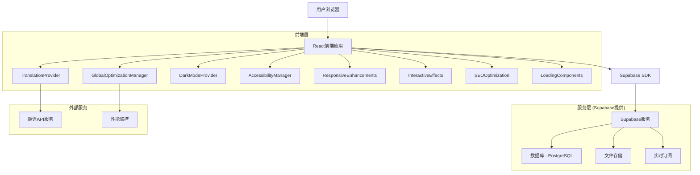
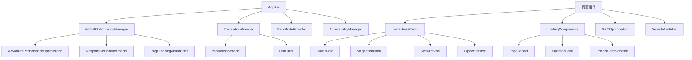
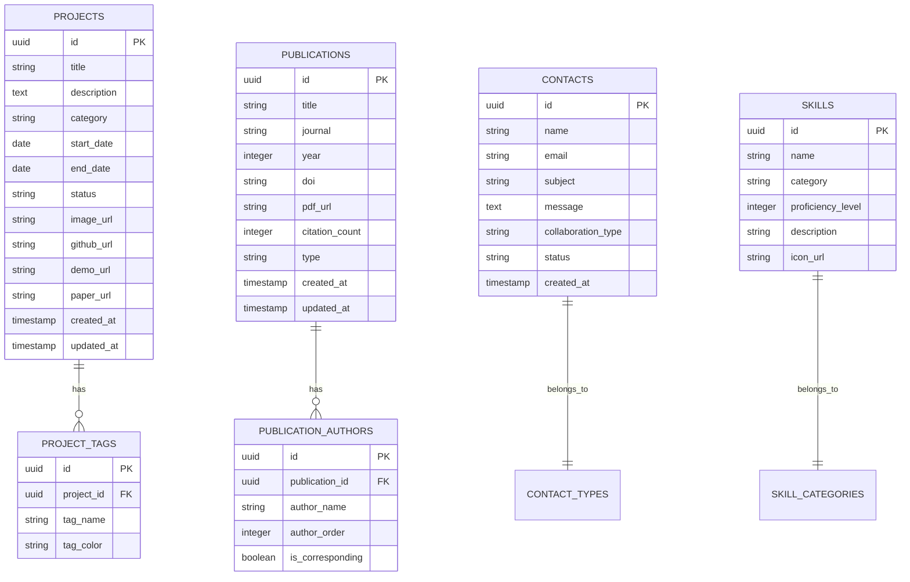

# 牟昭阳个人网站技术架构文档

## 1. Architecture design



## 2. Technology Description

### 2.1 核心技术栈

* Frontend: React\@18 + TypeScript + Tailwind CSS\@3 + Vite + Framer Motion

* Backend: Supabase (提供数据库、认证、存储服务)

* 部署: Vercel (前端) + Supabase (后端服务)

### 2.2 高级功能模块

* **性能优化系统**: GlobalOptimizationManager + AdvancedPerformanceOptimization

* **国际化系统**: TranslationProvider + 智能翻译服务 (zh/en)

* **主题系统**: DarkModeProvider + 深色/浅色/系统主题

* **可访问性增强**: AccessibilityEnhancements + 屏幕阅读器支持

* **响应式设计**: ResponsiveEnhancements + 移动端优化

* **交互效果**: InteractiveEffects + 高级动画系统

* **SEO优化**: SEOOptimization + 结构化数据

* **加载优化**: LoadingComponents + 骨架屏 + 懒加载

## 3. Route definitions

| Route         | Purpose              |
| ------------- | -------------------- |
| /             | 首页，展示个人介绍、研究亮点和最新动态  |
| /research     | 研究方向页，详细介绍科学计算和机器人研究 |
| /projects     | 项目展示页，展示核心项目和技术成果    |
| /publications | 学术成果页，展示论文、专利和学术活动   |
| /skills       | 技能与工具页，展示技术能力和工具熟练度  |
| /contact      | 联系方式页，提供联系信息和合作表单    |
| /admin        | 管理后台，用于内容更新和数据管理     |

## 4. 高级功能架构

### 4.1 性能优化系统

**GlobalOptimizationManager**

* 实时性能监控 (LCP, FID, CLS, FCP)

* 自适应配置优化 (移动端/网络/内存)

* 性能指标可视化面板

* 智能资源预加载

**AdvancedPerformanceOptimization**

* 代码分割与懒加载

* 网络状态监测

* 内存使用优化

* 缓存策略管理

### 4.2 国际化系统

**TranslationProvider**

* 中英文双语支持

* 智能翻译服务集成

* 本地翻译缓存

* 浏览器语言检测

* 实时页面内容翻译

### 4.3 主题与可访问性

**DarkModeProvider**

* 深色/浅色/系统主题

* 平滑主题切换动画

* 系统偏好检测

* 主题状态持久化

**AccessibilityEnhancements**

* 高对比度模式

* 大字体支持

* 减少动画选项

* 键盘导航增强

* 屏幕阅读器支持

* 文本转语音功能

* 色盲友好模式

### 4.4 响应式与交互

**ResponsiveEnhancements**

* 多设备断点检测

* 响应式容器组件

* 自适应网格布局

* 移动端菜单系统

**InteractiveEffects**

* 鼠标跟随效果

* 磁性按钮交互

* 悬浮卡片动画

* 滚动触发动画

* 打字机文本效果

* 粒子背景系统

### 4.5 SEO与加载优化

**SEOOptimization**

* 动态Meta标签管理

* 结构化数据 (JSON-LD)

* Open Graph支持

* 页面特定SEO配置

**LoadingComponents**

* 智能骨架屏系统

* 页面加载动画

* 组件级加载状态

* 渐进式内容加载

## 5. API definitions

### 5.1 Core API

**项目数据获取**

```
GET /api/projects
```

Response:

| Param Name  | Param Type | Description |
| ----------- | ---------- | ----------- |
| id          | string     | 项目唯一标识      |
| title       | string     | 项目标题        |
| description | string     | 项目描述        |
| tech\_stack | string\[]  | 技术栈数组       |
| category    | string     | 项目分类        |
| start\_date | string     | 开始时间        |
| status      | string     | 项目状态        |
| image\_url  | string     | 项目图片链接      |
| github\_url | string     | GitHub链接    |
| paper\_url  | string     | 相关论文链接      |

**论文数据获取**

```
GET /api/publications
```

Response:

| Param Name      | Param Type | Description |
| --------------- | ---------- | ----------- |
| id              | string     | 论文唯一标识      |
| title           | string     | 论文标题        |
| authors         | string\[]  | 作者列表        |
| journal         | string     | 期刊名称        |
| year            | number     | 发表年份        |
| doi             | string     | DOI链接       |
| citation\_count | number     | 引用次数        |
| pdf\_url        | string     | PDF链接       |

**联系表单提交**

```
POST /api/contact
```

Request:

| Param Name          | Param Type | isRequired | Description |
| ------------------- | ---------- | ---------- | ----------- |
| name                | string     | true       | 联系人姓名       |
| email               | string     | true       | 联系人邮箱       |
| subject             | string     | true       | 联系主题        |
| message             | string     | true       | 联系内容        |
| collaboration\_type | string     | false      | 合作类型        |

## 6. 组件架构与依赖关系

### 6.1 核心组件依赖图



### 6.2 Hook系统架构

| Hook名称            | 功能描述     | 依赖组件                      |
| ----------------- | -------- | ------------------------- |
| useOptimization   | 性能优化配置管理 | GlobalOptimizationManager |
| useTranslation    | 国际化翻译功能  | TranslationProvider       |
| useTheme          | 主题切换管理   | DarkModeProvider          |
| useResponsive     | 响应式断点检测  | ResponsiveEnhancements    |
| useAccessibility  | 可访问性配置   | AccessibilityManager      |
| usePageLoading    | 页面加载状态   | LoadingComponents         |
| useAdvancedSearch | 高级搜索过滤   | SearchAndFilter           |

### 6.3 样式系统架构

**CSS模块化结构**

* `index.css` - 全局基础样式

* `animations.css` - 动画效果样式

* `accessibility.css` - 可访问性样式

* `dark-mode.css` - 深色模式样式

* Tailwind CSS - 原子化样式系统

**主题变量系统**

```css
:root {
  --primary-color: #3b82f6;
  --secondary-color: #64748b;
  --accent-color: #f59e0b;
  --background-color: #ffffff;
  --text-color: #1f2937;
}

.dark {
  --background-color: #111827;
  --text-color: #f9fafb;
}
```

## 7. Data model

### 7.1 Data model definition



### 7.2 Data Definition Language

**项目表 (projects)**

```sql
-- 创建项目表
CREATE TABLE projects (
    id UUID PRIMARY KEY DEFAULT gen_random_uuid(),
    title VARCHAR(200) NOT NULL,
    description TEXT,
    category VARCHAR(50) NOT NULL,
    start_date DATE,
    end_date DATE,
    status VARCHAR(20) DEFAULT 'active' CHECK (status IN ('active', 'completed', 'paused')),
    image_url TEXT,
    github_url TEXT,
    demo_url TEXT,
    paper_url TEXT,
    created_at TIMESTAMP WITH TIME ZONE DEFAULT NOW(),
    updated_at TIMESTAMP WITH TIME ZONE DEFAULT NOW()
);

-- 创建项目标签表
CREATE TABLE project_tags (
    id UUID PRIMARY KEY DEFAULT gen_random_uuid(),
    project_id UUID REFERENCES projects(id) ON DELETE CASCADE,
    tag_name VARCHAR(50) NOT NULL,
    tag_color VARCHAR(7) DEFAULT '#3b82f6'
);

-- 创建论文表
CREATE TABLE publications (
    id UUID PRIMARY KEY DEFAULT gen_random_uuid(),
    title TEXT NOT NULL,
    journal VARCHAR(200),
    year INTEGER NOT NULL,
    doi TEXT,
    pdf_url TEXT,
    citation_count INTEGER DEFAULT 0,
    type VARCHAR(20) DEFAULT 'journal' CHECK (type IN ('journal', 'conference', 'patent')),
    created_at TIMESTAMP WITH TIME ZONE DEFAULT NOW(),
    updated_at TIMESTAMP WITH TIME ZONE DEFAULT NOW()
);

-- 创建论文作者表
CREATE TABLE publication_authors (
    id UUID PRIMARY KEY DEFAULT gen_random_uuid(),
    publication_id UUID REFERENCES publications(id) ON DELETE CASCADE,
    author_name VARCHAR(100) NOT NULL,
    author_order INTEGER NOT NULL,
    is_corresponding BOOLEAN DEFAULT FALSE
);

-- 创建联系表
CREATE TABLE contacts (
    id UUID PRIMARY KEY DEFAULT gen_random_uuid(),
    name VARCHAR(100) NOT NULL,
    email VARCHAR(255) NOT NULL,
    subject VARCHAR(200) NOT NULL,
    message TEXT NOT NULL,
    collaboration_type VARCHAR(50),
    status VARCHAR(20) DEFAULT 'new' CHECK (status IN ('new', 'read', 'replied')),
    created_at TIMESTAMP WITH TIME ZONE DEFAULT NOW()
);

-- 创建技能表
CREATE TABLE skills (
    id UUID PRIMARY KEY DEFAULT gen_random_uuid(),
    name VARCHAR(100) NOT NULL,
    category VARCHAR(50) NOT NULL,
    proficiency_level INTEGER CHECK (proficiency_level >= 1 AND proficiency_level <= 5),
    description TEXT,
    icon_url TEXT
);

-- 创建索引
CREATE INDEX idx_projects_category ON projects(category);
CREATE INDEX idx_projects_status ON projects(status);
CREATE INDEX idx_publications_year ON publications(year DESC);
CREATE INDEX idx_publications_type ON publications(type);
CREATE INDEX idx_contacts_status ON contacts(status);
CREATE INDEX idx_contacts_created_at ON contacts(created_at DESC);

-- 设置RLS权限
ALTER TABLE projects ENABLE ROW LEVEL SECURITY;
ALTER TABLE publications ENABLE ROW LEVEL SECURITY;
ALTER TABLE contacts ENABLE ROW LEVEL SECURITY;
ALTER TABLE skills ENABLE ROW LEVEL SECURITY;

-- 授予权限
GRANT SELECT ON projects TO anon;
GRANT SELECT ON publications TO anon;
GRANT SELECT ON skills TO anon;
GRANT INSERT ON contacts TO anon;
GRANT ALL PRIVILEGES ON ALL TABLES IN SCHEMA public TO authenticated;

-- 插入初始数据
INSERT INTO projects (title, description, category, start_date, status, github_url, paper_url) VALUES
('DamFormer', '溃坝仿真跨几何泛化 Transformer，构建多几何边界数据集，实现跨几何零样本预测', 'AI/ML', '2024-01-01', 'completed', '', 'https://doi.org/10.1063/5.0243570'),
('Sparse→Dense Transformer', '稀疏到稠密场重建，面向 CFD/环境流，稀疏传感重建高分辨率时空场', 'AI/ML', '2024-06-01', 'active', '', ''),
('仿生波动鳍推进仿真', 'Star-CCM+ CFD/FSI 仿真，Java Macro 自动化参数扫描', 'Robotics', '2024-06-01', 'active', '', ''),
('风扇阵列风洞(Fan-Wall)', '模块化 2.5m×2.5m 阵列，STM32 多板 PWM/TACH 闭环，VLAN/DHCP 网络管理', 'Hardware', '2023-01-01', 'active', '', ''),
('海洋观测浮标', '负责结构、密封、防腐、浮力计算、BOM 出图及池/海试', 'Robotics', '2022-01-01', 'completed', '', '');

INSERT INTO publications (title, journal, year, doi, type) VALUES
('Generalizing morphologies in dam break simulations using transformer model', 'Physics of Fluids', 2025, '10.1063/5.0243570', 'journal'),
('Rs-ModCubes: Self-reconfigurable, scalable, modular cubic robots for underwater operations', 'IEEE Robotics and Automation Letters', 2025, '', 'journal'),
('Deep-Learning-Assisted Triboelectric Whisker Sensor Array', 'Advanced Materials Technologies', 2025, '', 'journal'),
('Deep-learning-assisted triboelectric whisker', 'Nano Energy', 2024, '10.1016/j.nanoen.2024.110011', 'journal');

INSERT INTO skills (name, category, proficiency_level, description) VALUES
('Star-CCM+', 'CFD仿真', 5, 'CFD/FSI仿真，Java Macro自动化'),
('COMSOL', 'CFD仿真', 4, '多物理场仿真建模'),
('ANSYS', 'CFD仿真', 4, '工程仿真分析'),
('SolidWorks', '机械设计', 4, '三维建模与工程制图'),
('PyTorch', '深度学习', 5, 'DDP/AMP训练，模型部署'),
('Transformer', 'AI/ML', 5, 'Neural Operator建模CFD时空场'),
('STM32', '嵌入式', 4, '多板PWM/TACH闭环控制'),
('CUDA', '并行计算', 4, 'GPU加速计算');
```

## 8. 性能指标与优化

### 8.1 性能监控指标

| 指标名称                           | 目标值     | 当前实现 | 监控方式                    |
| ------------------------------ | ------- | ---- | ----------------------- |
| LCP (Largest Contentful Paint) | < 2.5s  | 实时监控 | PerformanceObserver API |
| FID (First Input Delay)        | < 100ms | 实时监控 | PerformanceObserver API |
| CLS (Cumulative Layout Shift)  | < 0.1   | 实时监控 | PerformanceObserver API |
| FCP (First Contentful Paint)   | < 1.8s  | 实时监控 | PerformanceObserver API |
| 内存使用率                          | < 80%   | 实时监控 | Performance Memory API  |
| 网络状态                           | 自适应     | 实时检测 | Network Information API |

### 8.2 优化策略

**代码分割优化**

* 路由级别的懒加载

* 组件级别的动态导入

* 第三方库的按需加载

**资源优化**

* 图片懒加载与优化

* 字体预加载

* CSS/JS 压缩与合并

**缓存策略**

* 浏览器缓存配置

* Service Worker 缓存

* 翻译内容缓存

## 9. 部署与运维

### 9.1 部署配置

**Vercel 部署配置 (vercel.json)**

```json
{
  "builds": [
    {
      "src": "package.json",
      "use": "@vercel/static-build",
      "config": {
        "distDir": "dist"
      }
    }
  ],
  "routes": [
    {
      "src": "/(.*)",
      "dest": "/index.html"
    }
  ],
  "headers": [
    {
      "source": "/(.*)",
      "headers": [
        {
          "key": "Cache-Control",
          "value": "public, max-age=31536000, immutable"
        }
      ]
    }
  ]
}
```

**环境变量配置**

* `VITE_SUPABASE_URL` - Supabase 项目 URL

* `VITE_SUPABASE_ANON_KEY` - Supabase 匿名密钥

* `VITE_TRANSLATION_API_KEY` - 翻译服务 API 密钥

### 9.2 监控与日志

**性能监控**

* 实时性能指标收集

* 用户体验指标追踪

* 错误日志记录

**SEO监控**

* 搜索引擎收录状态

* 页面加载速度监控

* 移动端友好性检测

## 10. 技术创新点

### 10.1 智能性能优化系统

* 基于设备类型和网络状况的自适应配置

* 实时性能指标监控与可视化

* 智能资源预加载策略

### 10.2 多语言智能翻译系统

* 本地翻译字典 + 在线翻译服务的混合模式

* 翻译缓存机制提升性能

* 实时页面内容翻译

### 10.3 全面的可访问性支持

* WCAG 2.1 AA 级别合规

* 屏幕阅读器优化

* 键盘导航增强

* 文本转语音功能

### 10.4 企业级组件架构

* 模块化组件设计

* TypeScript 类型安全

* 高度可复用的 Hook 系统

* 完善的错误边界处理

