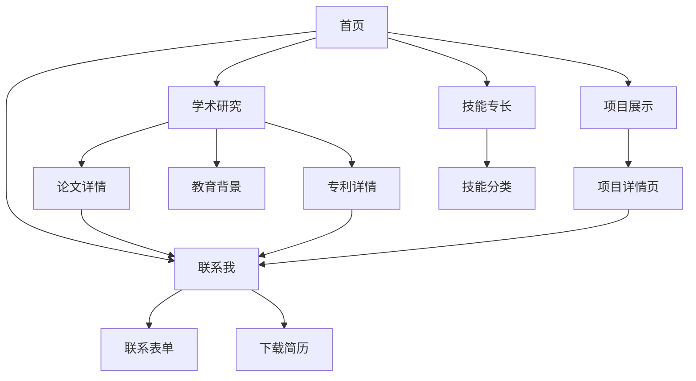

# 牟昭阳个人学术网站产品需求文档

## 1. 产品概述

本项目旨在为牟昭阳（Zhaoyang Mu）构建一个专业的个人学术网站，全面展示其在科学计算、机器人技术和人工智能交叉领域的研究成果与学术成就。

* 主要目的：展示学术研究成果、项目经历、技术能力和联系方式，为学术合作、求职和学术交流提供专业平台

* 目标用户：学术同行、潜在合作伙伴、招聘方、研究生导师和科研机构

* 市场价值：建立个人学术品牌，促进学术合作与职业发展

## 2. 核心功能

### 2.1 用户角色

| 角色  | 访问方式   | 核心权限                 |
| --- | ------ | -------------------- |
| 访问者 | 直接访问网站 | 浏览所有公开内容，下载简历，查看联系方式 |

### 2.2 功能模块

网站需求包含以下主要页面：

1. **首页（Home）**：个人介绍、研究亮点展示、最新动态、统计数据
2. **学术研究（Research）**：论文发表、专利申请、获奖荣誉、教育背景
3. **项目展示（Projects）**：科研项目详情、技术实现、项目成果
4. **技能专长（Skills）**：技术栈、工具使用、专业能力
5. **联系我（Contact）**：联系方式、社交媒体链接、合作意向

### 2.3 页面详情

| 页面名称 | 模块名称 | 功能描述                                                                                |
| ---- | ---- | ----------------------------------------------------------------------------------- |
| 首页   | 英雄区域 | 显示姓名"牟昭阳 Zhaoyang Mu"、当前身份"大连海事大学人工智能硕士在读 & 西湖大学访问学生"、研究方向描述                        |
| 首页   | 标签展示 | 展示核心研究关键词：Transformer神经算子、CFD仿真、水下机器人、仿生感知、机械设计                                     |
| 首页   | 研究亮点 | 轮播展示DamFormer、稀疏到稠密场重构、仿生鳍推进系统等核心研究成果                                               |
| 首页   | 最新动态 | 显示DamFormer论文被Physics of Fluids接收、Rs-ModCubes论文发表、专利获批等最新消息                         |
| 首页   | 统计数据 | 展示学术论文数量（10+篇）、发明专利数量（8项）、完成项目数量、获得奖项数量                                             |
| 首页   | 行动召唤 | 提供"联系我"和"下载简历"按钮                                                                    |
| 学术研究 | 教育背景 | 详细展示硕士（大连海事大学，2023.08-2026.06）、本科（材料科学与工程，2019.09-2023.06）、访问学者（西湖大学，2024.06至今）经历   |
| 学术研究 | 论文发表 | 列出代表性论文：DamFormer（Physics of Fluids 2025）、Rs-ModCubes（IEEE RA-L 2025）等，包含作者、期刊、发表时间 |
| 学术研究 | 专利申请 | 展示8项专利，包括水下机器人相关专利（CN119509546A等）、申请人、公开日期                                          |
| 学术研究 | 获奖荣誉 | 显示互联网+大赛金奖、机器人大会一等奖、机械创新设计大赛等奖项                                                     |
| 学术研究 | 搜索筛选 | 提供按类型（论文/专利/奖项）、状态（已发表/审稿中）筛选功能                                                     |
| 项目展示 | 项目列表 | 展示DamFormer、Sparse→Dense Transformer、仿生波动鳍推进仿真、风扇阵列风洞、海洋观测浮标等项目                     |
| 项目展示 | 项目详情 | 每个项目包含技术描述、实现方法、使用工具、项目成果、时间周期                                                      |
| 项目展示 | 技术标签 | 标注项目使用的技术栈：PyTorch、Star-CCM+、Java Macro、STM32等                                      |
| 技能专长 | 技能分类 | 按编程/ML、仿真/数值、机械/三维、硬件/控制、服务器/HPC、科研工具分类展示                                           |
| 技能专长 | 技能详情 | 详细列出Python（PyTorch/NumPy）、Star-CCM+（CFD/FSI）、SolidWorks、STM32等具体技能                  |
| 技能专长 | 熟练程度 | 通过进度条或星级显示各项技能的熟练程度                                                                 |
| 联系我  | 联系信息 | 显示邮箱（<mzymuzhaoyang@gmail.com>）、电话（+86 153 8213 0266）                               |
| 联系我  | 学术链接 | 提供Google Scholar、GitHub、LinkedIn、个人网站等链接                                            |
| 联系我  | 联系表单 | 提供在线联系表单，包含姓名、邮箱、主题、消息内容                                                            |
| 联系我  | 地理位置 | 显示当前所在地：杭州（西湖大学）                                                                    |

## 3. 核心流程

**访问者浏览流程：**
用户通过首页了解基本信息和研究亮点，可以选择深入了解学术研究成果、查看具体项目详情、了解技能专长，最终通过联系页面建立联系或下载简历。

**学术合作流程：**
潜在合作者通过研究页面了解学术成果，查看项目页面了解技术能力，通过联系页面发起合作意向。

## 4. 用户界面设计

### 4.1 设计风格

* **主色调**：深蓝色（#1e3a8a）体现学术专业性，辅助色为科技蓝（#3b82f6）

* **次要颜色**：浅灰色（#f8fafc）作为背景，深灰色（#1f2937）作为文字颜色

* **按钮样式**：圆角矩形按钮，悬停时有渐变效果和阴影

* **字体**：中文使用思源黑体，英文使用Inter字体，代码使用JetBrains Mono

* **字体大小**：标题32px，副标题24px，正文16px，小字14px

* **布局风格**：现代卡片式布局，顶部导航栏，响应式网格系统

* **图标风格**：使用Heroicons或Lucide图标库，简洁线性风格

* **动画效果**：平滑的页面切换、悬停效果、滚动动画

### 4.2 页面设计概览

| 页面名称 | 模块名称 | UI元素                                       |
| ---- | ---- | ------------------------------------------ |
| 首页   | 英雄区域 | 大标题渐变文字效果，个人照片圆形头像，动态打字效果展示研究方向，CTA按钮使用品牌色 |
| 首页   | 研究亮点 | 卡片轮播组件，每张卡片包含标题、描述、技术标签，指示器显示当前位置          |
| 首页   | 最新动态 | 时间线布局，每条动态包含日期、标题、简短描述，悬停时卡片轻微上浮           |
| 首页   | 统计数据 | 数字动画效果，图标+数值+标签的组合，网格布局                    |
| 学术研究 | 论文列表 | 表格或卡片布局，包含论文标题、作者、期刊、年份，支持排序和筛选            |
| 学术研究 | 专利展示 | 卡片布局，显示专利号、标题、申请人、状态，使用不同颜色标识状态            |
| 项目展示 | 项目网格 | 响应式网格布局，每个项目卡片包含缩略图、标题、技术标签、简短描述           |
| 项目展示 | 项目详情 | 模态框或独立页面，包含项目介绍、技术实现、成果展示、相关链接             |
| 技能专长 | 技能分类 | 标签页或手风琴布局，每个分类下显示具体技能和熟练度                  |
| 技能专长 | 技能进度 | 进度条动画，技能图标+名称+熟练度百分比                       |
| 联系我  | 联系信息 | 卡片布局，图标+文字组合，点击可复制或跳转                      |
| 联系我  | 联系表单 | 现代表单设计，输入框聚焦效果，提交按钮加载状态                    |

### 4.3 响应式设计

* **桌面优先设计**：主要针对1920x1080及以上分辨率优化

* **移动端适配**：支持手机和平板设备，采用汉堡菜单导航

* **触摸优化**：按钮和链接区域足够大，支持触摸手势

* **性能优化**：图片懒加载，代码分割，CDN加速

