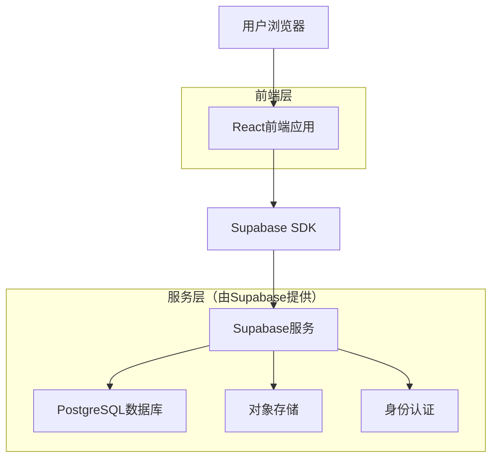
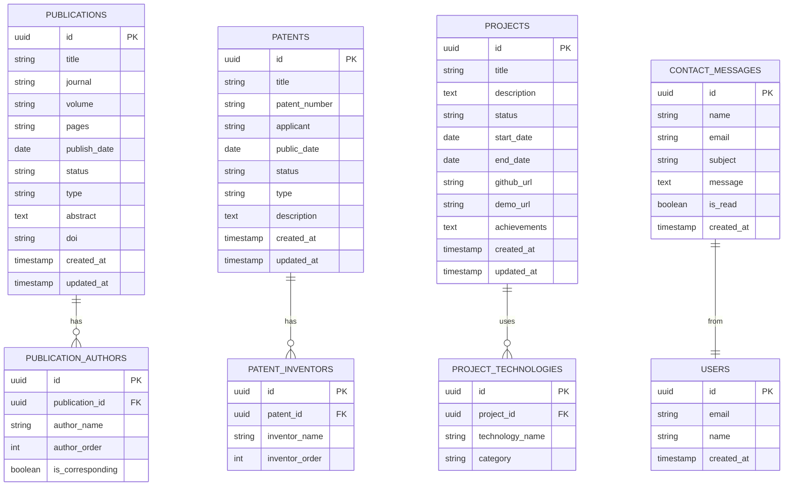

# 牟昭阳个人学术网站技术架构文档

## 1. 架构设计



## 2. 技术描述

- **前端**：React@18 + TypeScript + Tailwind CSS@3 + Vite
- **后端**：Supabase（提供数据库、认证、存储服务）
- **状态管理**：React Context + useState/useReducer
- **路由**：React Router@6
- **UI组件**：Headless UI + 自定义组件
- **图标**：Heroicons
- **动画**：Framer Motion
- **国际化**：React i18next

## 3. 路由定义

| 路由 | 用途 |
|------|------|
| / | 首页，展示个人介绍、研究亮点、最新动态和统计数据 |
| /research | 学术研究页面，展示论文、专利、奖项和教育背景 |
| /projects | 项目展示页面，展示科研项目和技术实现 |
| /skills | 技能专长页面，展示技术栈和专业能力 |
| /contact | 联系页面，提供联系方式和联系表单 |
| /ascii-demo | ASCII演示页面，展示技术能力 |

## 4. API定义

### 4.1 核心API

联系表单提交
```
POST /api/contact
```

请求参数：
| 参数名称 | 参数类型 | 是否必需 | 描述 |
|----------|----------|----------|------|
| name | string | true | 联系人姓名 |
| email | string | true | 联系人邮箱 |
| subject | string | true | 联系主题 |
| message | string | true | 联系内容 |

响应：
| 参数名称 | 参数类型 | 描述 |
|----------|----------|------|
| success | boolean | 提交是否成功 |
| message | string | 响应消息 |

示例请求：
```json
{
  "name": "张三",
  "email": "zhangsan@example.com",
  "subject": "学术合作咨询",
  "message": "希望了解您在Transformer神经算子方面的研究..."
}
```

获取研究成果数据
```
GET /api/research
```

响应：
| 参数名称 | 参数类型 | 描述 |
|----------|----------|------|
| publications | array | 论文列表 |
| patents | array | 专利列表 |
| awards | array | 奖项列表 |

获取项目数据
```
GET /api/projects
```

响应：
| 参数名称 | 参数类型 | 描述 |
|----------|----------|------|
| projects | array | 项目列表 |

## 5. 数据模型

### 5.1 数据模型定义



### 5.2 数据定义语言

论文表（publications）
```sql
-- 创建表
CREATE TABLE publications (
    id UUID PRIMARY KEY DEFAULT gen_random_uuid(),
    title VARCHAR(500) NOT NULL,
    journal VARCHAR(200),
    volume VARCHAR(50),
    pages VARCHAR(50),
    publish_date DATE,
    status VARCHAR(20) DEFAULT 'published' CHECK (status IN ('published', 'accepted', 'under_review', 'preparing')),
    type VARCHAR(20) DEFAULT 'journal' CHECK (type IN ('journal', 'conference')),
    abstract TEXT,
    doi VARCHAR(200),
    created_at TIMESTAMP WITH TIME ZONE DEFAULT NOW(),
    updated_at TIMESTAMP WITH TIME ZONE DEFAULT NOW()
);

-- 创建索引
CREATE INDEX idx_publications_publish_date ON publications(publish_date DESC);
CREATE INDEX idx_publications_status ON publications(status);
CREATE INDEX idx_publications_type ON publications(type);

-- 初始数据
INSERT INTO publications (title, journal, volume, pages, publish_date, status, type, abstract, doi) VALUES
('Generalizing morphologies in dam break simulations using transformer model', 'Physics of Fluids', '37', '016612', '2025-01-01', 'published', 'journal', 'DamFormer: 基于Transformer的溃坝流动预测神经算子研究', '10.1063/5.0243570'),
('Rs-ModCubes: Self-reconfigurable, scalable, modular cubic robots for underwater operations', 'IEEE Robotics and Automation Letters', NULL, NULL, '2025-01-01', 'published', 'journal', '重构机器人系统设计研究', NULL);
```

专利表（patents）
```sql
-- 创建表
CREATE TABLE patents (
    id UUID PRIMARY KEY DEFAULT gen_random_uuid(),
    title VARCHAR(500) NOT NULL,
    patent_number VARCHAR(100) UNIQUE NOT NULL,
    applicant VARCHAR(200) NOT NULL,
    public_date DATE,
    status VARCHAR(20) DEFAULT 'granted' CHECK (status IN ('granted', 'pending', 'rejected')),
    type VARCHAR(20) DEFAULT 'invention' CHECK (type IN ('invention', 'utility', 'design')),
    description TEXT,
    created_at TIMESTAMP WITH TIME ZONE DEFAULT NOW(),
    updated_at TIMESTAMP WITH TIME ZONE DEFAULT NOW()
);

-- 创建索引
CREATE INDEX idx_patents_public_date ON patents(public_date DESC);
CREATE INDEX idx_patents_status ON patents(status);
CREATE INDEX idx_patents_applicant ON patents(applicant);

-- 初始数据
INSERT INTO patents (title, patent_number, applicant, public_date, status, type, description) VALUES
('水下机器人动态环境感知和导航装置及方法', 'CN119509546A', '西湖大学', '2024-11-06', 'granted', 'invention', '水下机器人环境感知技术'),
('基于矢量八推布局的水下机器人', 'CN119239885A', '西湖大学', '2024-11-06', 'granted', 'invention', '水下机器人推进系统设计'),
('基于波动鳍推进的水下机器人', 'CN119142488A', '西湖大学', '2024-11-06', 'granted', 'invention', '仿生波动鳍推进技术');
```

项目表（projects）
```sql
-- 创建表
CREATE TABLE projects (
    id UUID PRIMARY KEY DEFAULT gen_random_uuid(),
    title VARCHAR(200) NOT NULL,
    description TEXT NOT NULL,
    status VARCHAR(20) DEFAULT 'completed' CHECK (status IN ('completed', 'ongoing', 'planned')),
    start_date DATE,
    end_date DATE,
    github_url VARCHAR(500),
    demo_url VARCHAR(500),
    achievements TEXT,
    created_at TIMESTAMP WITH TIME ZONE DEFAULT NOW(),
    updated_at TIMESTAMP WITH TIME ZONE DEFAULT NOW()
);

-- 创建索引
CREATE INDEX idx_projects_status ON projects(status);
CREATE INDEX idx_projects_start_date ON projects(start_date DESC);

-- 初始数据
INSERT INTO projects (title, description, status, start_date, end_date, github_url, demo_url, achievements) VALUES
('DamFormer', '溃坝仿真跨几何泛化Transformer，构建多几何边界数据集，实现跨几何零样本预测', 'completed', '2024-01-01', '2024-12-31', 'https://github.com/Pitohuie/DamFormer', NULL, '发表于Physics of Fluids期刊'),
('Sparse→Dense Transformer', '稀疏到稠密场重建，面向CFD/环境流，稀疏传感重建高分辨率时空场', 'ongoing', '2024-06-01', NULL, 'https://pitohuie-aiversion.github.io/Sparse_to_Dense_Transformer/', 'https://pitohuie-aiversion.github.io/Sparse_to_Dense_Transformer/', '正在进行中的研究项目'),
('仿生波动鳍推进仿真', 'Star-CCM+ CFD/FSI仿真，Java Macro自动化参数扫描', 'ongoing', '2024-06-01', NULL, NULL, NULL, '西湖大学合作项目');
```

联系消息表（contact_messages）
```sql
-- 创建表
CREATE TABLE contact_messages (
    id UUID PRIMARY KEY DEFAULT gen_random_uuid(),
    name VARCHAR(100) NOT NULL,
    email VARCHAR(255) NOT NULL,
    subject VARCHAR(200) NOT NULL,
    message TEXT NOT NULL,
    is_read BOOLEAN DEFAULT FALSE,
    created_at TIMESTAMP WITH TIME ZONE DEFAULT NOW()
);

-- 创建索引
CREATE INDEX idx_contact_messages_created_at ON contact_messages(created_at DESC);
CREATE INDEX idx_contact_messages_is_read ON contact_messages(is_read);

-- 权限设置
GRANT SELECT ON contact_messages TO anon;
GRANT ALL PRIVILEGES ON contact_messages TO authenticated;
GRANT SELECT, INSERT ON publications TO anon;
GRANT ALL PRIVILEGES ON publications TO authenticated;
GRANT SELECT, INSERT ON patents TO anon;
GRANT ALL PRIVILEGES ON patents TO authenticated;
GRANT SELECT, INSERT ON projects TO anon;
GRANT ALL PRIVILEGES ON projects TO authenticated;
```