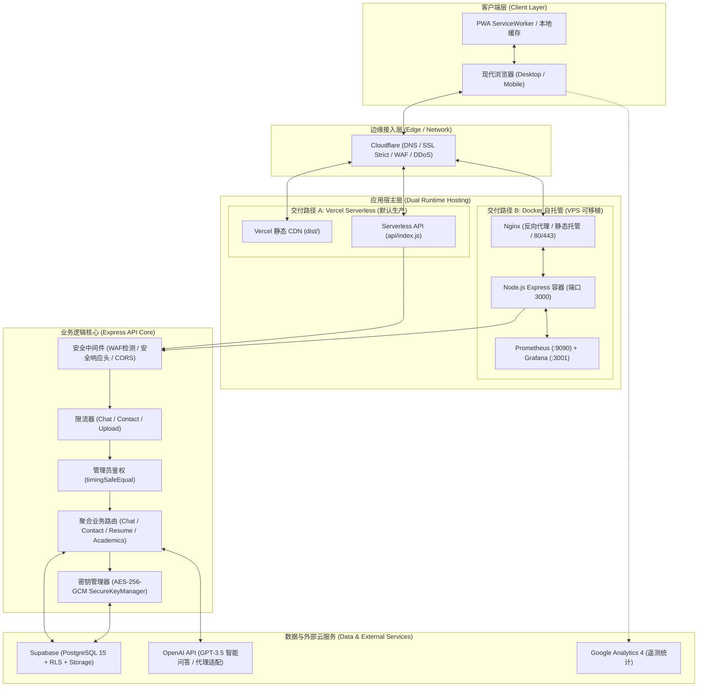
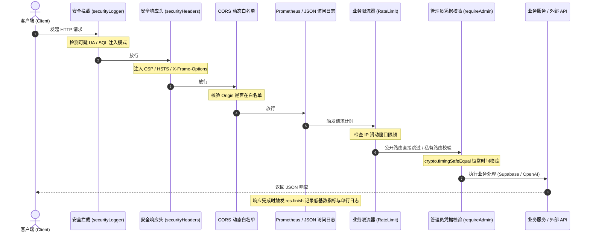
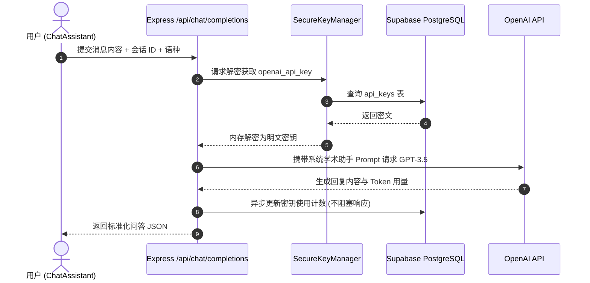

# 系统全景架构设计文档 (System Architecture)

本文档阐述 **牟昭阳个人学术与工程网站 (Zhaoyang Mu Personal Website)** 的全景系统架构、技术选型矩阵、前后端运行时模型、安全加密机制及数据流向。

---

## 1. 架构全景图

系统采用现代化全栈分层解耦架构，支持云原生无服务器（Vercel Serverless）与独立容器化（Docker Compose）双重部署形态：



---

## 2. 技术选型矩阵

| 分层维度 | 技术方案 | 版本 / 规范 | 核心考量与价值 |
| :--- | :--- | :--- | :--- |
| **前端框架** | React | `^18.3.1` | 兼具极高生态成熟度、并发渲染、虚拟 DOM 与组件解耦能力 |
| **前端语言** | TypeScript | `~5.8.3` | 全栈严格类型系统，保障大型组件树与数据接口的数据一致性 |
| **构建工具** | Vite | `^6.4.3` | 极速冷启动、Rollup 生产打包、按需编译与精细 Chunk 拆分 |
| **样式体系** | Tailwind CSS | `^3.4.17` | 原子化实用类优先，结合 CSS 变量实现零运行时开销的深浅色主题切换 |
| **动效与视觉** | Framer Motion / Canvas | `^10.16.16` | 声明式组件进入/离开过渡，自主实现 ASCII 律动矩阵与粒子场交互 |
| **国际化** | react-i18next | `^15.2.0` | 中英双语实时切换，配合脚本确保 2200+ 词条强一致性 |
| **状态管理** | Zustand | `^5.0.3` | 轻量化、无样板代码、高内聚的状态存储（聊天会话、简历状态） |
| **路由系统** | React Router | `^7.18.2` | 声明式客户端 SPA 路由，具备动态按需加载 (lazy) 与权限守卫 |
| **后端运行时** | Node.js | `>=22.0.0` | 拥有现代 ESM 原生支持、高性能 V8 引擎与内置 Crypto 安全组件 |
| **API 服务端** | Express | `^4.22.2` | 精简灵活的中间件机制，完美适配单函数无服务调用与容器化服务 |
| **数据库** | Supabase (PostgreSQL) | `PostgreSQL 15` | 云端托管关系型数据库、行级安全机制 (RLS) 与自动化迁移系统 |
| **模型对接** | OpenAI Node SDK | `^4.104.0` | 驱动个人知识库与 GPT 助手，具备代理通道支持与安全限速降级 |
| **可观测性** | Prometheus / Prom-Client | Text Format 0.0.4 | 提供低基数、高性能的 `/api/metrics` 探针与进程运行指标收集 |

---

## 3. 前端架构深度设计

### 3.1 目录组织与分层原则
前端代码统一位于 `src/` 目录下，遵循职责高度单一的分层架构：
- `src/types/`: 集中领域类型系统（`academic`, `blog`, `contact`, `particle`, `project`, `resume`, `routes`, `search`, `skill`），由 `index.ts` 统一 Barrel Export，彻底消除跨模块类型循环依赖。
- `src/routes/`: 集中路由映射表（`routes.config.tsx`）、页面无障碍动效切换（`AppRoutes.tsx`）与私有路由守卫（`PrivateRouteSEO.tsx`）。
- `src/components/`:
  - `common/`: 跨模块通用底座（暗色模式提供者、错误边界、SEO 注入、权限门禁 `AdminGate`、响应式容器）。
  - `features/`: 核心业务特性组件（`blog/`、`chat/`、`contact/`、`projects/`、`publications/`、`research/`、`resume/`、`search/`、`skills/` 等）。
  - `layout/`: 全局页面骨架（`Navbar`、`Footer`、无障碍工具栏）。
  - `seo/`: 结构化数据 (JSON-LD) 与 Google Analytics 注入。
  - `ParticleField/`: 3D WebGL / Canvas 粒子渲染引擎底座及其模块化设置面板（`settings/`）。
- `src/pages/`: 页面顶层容器，仅负责组合特性组件与路由占位。
- `src/locales/`: 中英文语言字典（`zh.json` 与 `en.json`），2269 个国际化 Key 严格对称。
- `src/hooks/`: 自定义复合 Hook（媒体查询、主题、防抖、键盘快捷键、性能监控）。
- `src/lib/` & `src/services/`: 客户端 API 请求封装与 Supabase 客户端实例。

### 3.2 路由与按需懒加载 (Code Splitting)
所有顶级路由组件均使用 `React.lazy()` 配合动态 `import()` 包装，防止初始化加载冗余代码包：
- 主页包体积得到严格控制，博客、粒子场设置、简历后台等重量级功能仅在初次路由导航时加载对应 Chunk。
- 管理后台路由（`/contact-admin` 与 `/resume-manager`）配置了 `isPrivate: true` 标记，由 `PrivateRouteSEO` 进行动态拦截：若无客户端凭据，优雅降级为身份输入框并阻止网络爬虫索引敏感路径。

### 3.3 无障碍 (a11y) 与 SEO 体系
- **无障碍访问**: 全站提供 `<a href="#main-content" className="skip-link">` 快捷直达内容锚点，内建 `AccessibilityManager` 与高对比度/字体缩放工具栏。
- **结构化数据 (JSON-LD)**: 通过 `StructuredDataSEO` 动态注入 Schema.org 标准的 `Person` 对象，向搜索引擎明确输出学者姓名、工作机构、教育背景与学术链接（Google Scholar, LinkedIn, GitHub, ResearchGate）。

---

## 4. 后端架构与运行时模型

### 4.1 双运行时适配设计 (Dual-Runtime Design)
后端入口 `api/index.js` 经过高度抽象，实现了一套代码同时支持两种完全不同的生产运行环境：

```javascript
// 当在本地或 Docker 环境中执行时 (无 VERCEL 环境变量)
const SHOULD_LISTEN = !process.env.VERCEL;
if (SHOULD_LISTEN) {
  server = app.listen(PORT, () => {
    console.log(`🚀 Server running on http://localhost:${PORT}`);
  });
}

// 导出为 Vercel Serverless Function 处理器
export default (req, res) => app(req, res);
```

1. **Vercel Serverless 模式**:
   - `vercel.json` 将所有 `/api/(.*)` 请求统统重写至 `/api/index.js`。
   - 避免拆分几十个微函数带来的额外冷启动损耗与 Vercel 免费计划函数数量配额限制。
2. **独立容器化 / VPS 模式**:
   - 监听本地指定端口（默认 3001 或 Docker 中 3000）。
   - 内置监听 `SIGTERM` 与 `SIGINT` 信号，实施 10 秒超时强制退出的优雅停机机制 (Graceful Shutdown)。

### 4.2 中间件链路流水线



---

## 5. 安全体系与加密子系统

### 5.1 密钥分级与隔离策略
项目对不同安全等级的凭据制定了不可违背的隔离规范：
1. **公开只读变量 (`VITE_*`)**:
   - 构建时注入前端静态代码（例如 `VITE_SUPABASE_URL`, `VITE_SUPABASE_ANON_KEY`, `VITE_GOOGLE_ANALYTICS_ID`）。
   - 不允许在此类变量中注入任何具备写权限或敏感服务密钥。
2. **服务端敏感变量**:
   - `SUPABASE_SERVICE_ROLE_KEY`、`ADMIN_TOKEN`、`KEY_ENCRYPTION_KEY`、`OPENAI_API_KEY`。
   - 绝不进入浏览器产物；生产环境中由 Vercel Project Environment Variables 或 Docker `.env` 严格挂载。

### 5.2 AES-256-GCM 应用层加密密钥管理 (`SecureKeyManager`)
为了防止第三方 API 密钥（如动态轮换的 OpenAI 密钥）在数据库中明文暴露，后端封装了 `SecureKeyManager`：
- **加密算法**: `aes-256-gcm`
- **向量与校验**: 每次加密生成独立的随机 16 字节 IV，并提取 16 字节认证标签 (Auth Tag)。
- **存储格式**: `iv:authTag:encryptedContent`
- **防暴力破解与安全统计**: 数据库配合提供 `update_api_key_usage` 与 `rotate_api_key` 存储过程，对密钥调用量、错误率与最后调用时间进行无感追踪。

### 5.3 防时序攻击身份认证
在 `/api/resume/*` 与 `/api/contact/messages*` 等管理接口中，利用 `crypto.timingSafeEqual` 对比 HTTP 请求中的 Bearer 令牌与服务端环境变量 `ADMIN_TOKEN`：
- 严格杜绝由于标准字符串对比短路引起的侧信道时序攻击 (Timing Attack)。

---

## 6. 核心业务数据流向

### 6.1 AI 智能问答流 (Chat Completion Flow)


### 6.2 联系留言提交流 (Contact Submission Flow)
1. 用户在前端填写姓名、邮箱、主题、合作类型与留言详情。
2. 前端请求 `/api/contact/submit`（受 15 分钟 10 次的 IP 频控限制）。
3. 后端严格校验邮箱正则与 10~2000 字符长度。
4. 数据落库至 Supabase `contact_messages` 表（状态初始化为 `new`）。
5. 若处于本地离线开发且无法连接 Supabase，系统自动执行平滑 Mock 降级，保障本地 UI 联调畅通。

### 6.3 简历数据全生命周期管理 (Resume Management Flow)
1. 管理员登录 `/resume-manager`，通过 Bearer Token 完成认证。
2. 前端向 `/api/resume/data` 请求聚合数据集，并行拉取个人信息、教育、工作、科研经历、技术栈、语言、学术出版物等。
3. 管理员可在界面上直接新增、编辑或删除特定经历项，由 `/api/resume/data/:section` 对应端点进行增量维护。

---

## 7. 架构演进与可维护性保障

1. **依赖健康度监控**: 每周由 GitHub Dependabot 监控组件漏洞，配合 `scripts/security/audit-production.js` 进行自动化生产依赖风险审计。
2. **多语言对齐保障**: 借助 `scripts/i18n-validate.js` 在构建与 CI 时自动扫描键值树缺失与孤立硬编码。
3. **零外部网络假定的 API 冒烟测试**: `npm run test:api` 在独立动态端口拉起真实服务端测试健康探针，解除了本地固定端口冲突的测试痛点。
