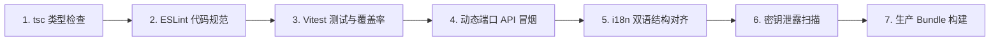

# 本地开发与工程化规范指南 (Developer Setup & Standards)

本文档面向所有参与 **牟昭阳个人学术与工程网站** 开发与维护的工程师，提供完整的本地环境搭建、配置字典、开发工作流、质量门禁规范及疑难排查手册。

---

## 1. 环境准备 (Prerequisites)

在开始前，请确保您的本地计算机满足以下环境版本要求：

- **Node.js**: `>= 22.0.0` (推荐使用 LTS 最新稳定版)
- **npm**: `>= 10.0.0`
- **Git**: `>= 2.30.0`
- **操作系统**: Windows 10/11、macOS 或 Linux

> [!TIP]
> 仓库根目录包含 `.nvmrc` 文件，可直接通过 `nvm use` 自动切换到匹配的 Node.js 运行版本。

---

## 2. 环境变量字典与配置 (Environment Configuration)

1. 复制模板并创建本地配置文件：
   ```bash
   cp .env.example .env
   ```
2. 打开 `.env`，按以下规范与字典配置各项键值：

### 2.1 完整变量解析表

| 变量名 | 归属环境 | 必填 | 默认 / 示例值 | 用途与安全准则 |
| :--- | :--- | :--- | :--- | :--- |
| `VITE_SUPABASE_URL` | 前端 (公开) | 是 | `https://your-proj.supabase.co` | Supabase 项目网关地址，用于客户端读取公开学术/博客数据 |
| `VITE_SUPABASE_ANON_KEY` | 前端 (公开) | 是 | `eyJhbGciOi...` | Supabase 匿名访问公钥，仅具备 RLS 授权的只读/受限插入权限 |
| `SUPABASE_SERVICE_ROLE_KEY` | **后端 (极度敏感)** | 是 | `eyJhbGciOi...` | **绝不可带 VITE_ 前缀！** 拥有数据库完整管理特权，仅限服务端 |
| `OPENAI_API_KEY` | **后端 (极度敏感)** | 否 | `sk-...` | OpenAI 官方或中转 API 密钥，用于个人智能学术助手交互 |
| `KEY_ENCRYPTION_KEY` | **后端 (极度敏感)** | 是 | 32位随机字符串 | 用于应用层 AES-256-GCM 加密数据库存储 API Key 的主密钥 |
| `ADMIN_TOKEN` | **后端 (极度敏感)** | 是 | 长随机安全字符串 | 用于保护 `/api/resume/*` 与留言后台管理接口的 Bearer 令牌 |
| `VITE_GOOGLE_ANALYTICS_ID` | 前端 (公开) | 否 | `G-XXXXXXXXXX` | Google Analytics 4 网站统计 ID |
| `VITE_ALLOW_INLINE_JSONLD` | 前端 (公开) | 否 | `true` | 是否允许向 HTML 注入 Schema.org 结构化元数据以增强学术 SEO |
| `PORT` | 后端 (配置) | 否 | `3001` | Express 服务端本地监听端口（开发默认 3001，生产自托管 3000） |
| `USE_LOCAL_PROXY` | 后端 (开发) | 否 | `false` | 仅在大陆本地调试需要访问 OpenAI 时开启，生产环境自动强制禁用 |
| `CORS_ORIGIN` | 后端 (安全) | 否 | `http://localhost:5173` | 允许跨域的前端来源列表，多个来源之间使用英文逗号 `,` 分隔 |
| `RATE_LIMIT_WINDOW_MS` | 后端 (安全) | 否 | `900000` (15分钟) | 接口限流计数时间窗口（毫秒） |
| `RATE_LIMIT_MAX_REQUESTS` | 后端 (安全) | 否 | `100` | 默认全局单 IP 最大允许请求数 |

> [!CAUTION]
> **安全红线**:
> 1. 切勿将真实的 `.env` 提交至 Git 仓库（`.gitignore` 已默认忽略）。
> 2. `VITE_` 前缀的变量会在构建时**全量内联编译**到客户端 JS 代码中，对所有互联网用户完全可见。严禁将任何数据库服务角色密钥、加密私钥或 OpenAI Key 冠以 `VITE_` 前缀！

---

## 3. 本地启动工作流 (Local Workflows)

### 3.1 安装依赖
推荐使用 `npm ci` 确保安装与 `package-lock.json` 完全一致的干净依赖树：
```bash
npm ci
```

### 3.2 启动开发服务器
开发推荐同时拉起前端 Vite 服务器与 Express API：
```bash
npm run dev:full
```

> [!NOTE]
> **Windows PowerShell 执行策略提示**:
> 若在 Windows PowerShell 下遇到 `无法加载文件 npm.ps1，因为在此系统上禁止运行脚本`，可使用同等原生命令：
> ```powershell
> npm.cmd run dev:full
> ```
> 无需提升管理员权限修改全局执行策略。

启动成功后各服务地址如下：
- **前端页面**: `http://localhost:5173`
- **后端 API 根地址**: `http://localhost:3001/api`
- **后端探针**: `http://localhost:3001/api/health`
- **Prometheus 探针**: `http://localhost:3001/api/metrics`

### 3.3 常用命令速查表

| 指令 | 说明 |
| :--- | :--- |
| `npm run dev` | 仅启动前端 Vite 开发服务器 (`http://localhost:5173`) |
| `npm run dev:api` | 仅启动本地后端 Node.js Express 服务 (`http://localhost:3001`) |
| `npm run dev:full` | 使用 `concurrently` 并行启动前端与后端 |
| `npm run check` | 执行全工程 TypeScript 静态类型检查 (`tsc -b --noEmit`) |
| `npm run lint` | 执行 ESLint 9 代码规范检测 |
| `npm run test:run` | 单次运行 Vitest 单元与组件测试 |
| `npm run test:coverage`| 运行测试并生成 `coverage/` 覆盖率报告 |
| `npm run test:api` | 在**动态临时端口**拉起临时服务器，自测 API 健康探针与指标 |
| `npm run i18n:validate`| 递归校验 `zh.json` 与 `en.json` 的 2200+ 词条一致性 |
| `npm run scan:secrets` | 全仓深度扫描代码是否存在明文密钥或硬编码敏感字符串 |
| `npm run audit:prod` | 联网比对生产依赖 CVE 漏洞（遵循 `docs/SECURITY_EXCEPTIONS.md`） |
| `npm run build` | 编译生产环境静态文件并输出至 `dist/` |
| `npm run verify` | **终极质量门禁**: 顺序串行执行全部检查，确保 100% 可发版 |

---

## 4. 质量门禁与验证体系 (Quality Gates)

在提交任何代码或发起 Pull Request 之前，必须在本地终端运行：
```bash
npm run verify
```

`npm run verify` 是本项目的综合守卫流水线，严格串行执行以下 7 个维度的检测，任何一项报错即时阻断：



1. **类型安全性**: 确保没有任何 TypeScript 类型错误与缺失。
2. **规范契约**: ESLint 统一校验 React Hooks 依赖完整性与现代语法。
3. **功能回归**: Vitest 执行测试用例并验证防衰退基线。
4. **服务可用性**: 运行 `smoke-api.js` 与 `smoke-api-serverless.js`，避免提交破坏 `/api/health` 或指标抓取。
5. **双语对齐**: 确保中文与英文词条数目相同、树形嵌套一致。
6. **合规安全**: 正则扫描防范将私钥或高危 Token 误打入 Git 仓库。
7. **可构建性**: 产物最终输出在 `dist/`，确保无打包时语法错误。

---

## 5. 常见问题排查与 FAQ

### Q1: 本地开发无法连接 Supabase 报错 `fetch failed` 或 `ENOTFOUND`？
- **机制与原因**: 本地处于离线状态，或 Supabase 免费实例休眠/网络抖动。
- **解决方案**: 后端对 `/api/contact/submit` 等核心交互做了本地 Mock 弹性降级处理（返回 `dev_mock` 状态），不阻塞前端页面与表单提交联调。恢复网络后即可直接落库。

### Q2: 提示 `English keys: 2269, Chinese keys: 2268` 验证失败？
- **原因**: 在前端界面新增了翻译词条，但只修改了 `src/locales/zh.json` 或 `en.json` 其中一个。
- **处理**: 运行 `npm run i18n:validate` 会精确打印缺失的父子路径，将对应英文/中文翻译补充完整即可。

### Q3: 本地调用 OpenAI 接口超时 (Timeout)？
- **原因**: 处于部分网络受限环境时，Node.js 无法直接建立与 `api.openai.com` 的 TLS 连接。
- **处理**: 打开 `.env`，设置 `USE_LOCAL_PROXY=true`。后端将自动启用本地代理适配（默认代理端口 `127.0.0.1:59010`）。生产环境此设置会自动失效，确保线上安全。

### Q4: 生产依赖审计报高危警告 (`npm run audit:prod`)？
- **原因**: 生产依赖中引入了存在 CVE 披露的包。
- **处理**:
  1. 优先执行 `npm update <package>` 尝试无损升级。
  2. 若受影响包（如 `react-router`）官方暂未发布针对当前 SPA 的无损修复版本，但已分析确认安全边界（例如公告仅影响未使用的 RSC 特性），需按照 [SECURITY_EXCEPTIONS.md](file:///x:/2025/Zhaoyang_Master_personal_website_rebulid/docs/SECURITY_EXCEPTIONS.md) 流程登记受限例外并设定明确到期日。
