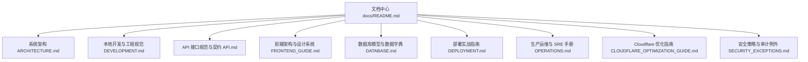

# 项目开发与运维文档中心 (Documentation Hub)

欢迎查阅 **牟昭阳个人学术与工程网站 (Zhaoyang Mu Personal Website)** 开发与运维文档中心。本项目采用前后端现代化全栈架构（React 18 + TypeScript + Vite + Express + Supabase + OpenAI），支持 Vercel Serverless 与 Docker Compose 自托管双交付模式。

本文档中心对整个代码空间的系统设计、开发规范、API 契约、数据模型、前端工程、部署与生产运维进行了系统化整理与归类。

---

## 快速导航地图

| 模块 | 核心文档 | 适用对象 | 核心内容概述 |
| :--- | :--- | :--- | :--- |
| **全景架构** | [系统全景架构设计 (ARCHITECTURE.md)](file:///x:/2025/Zhaoyang_Master_personal_website_rebulid/docs/ARCHITECTURE.md) | 架构师 / 全栈开发者 | 技术选型、前后端分层、微内核数据流、安全加密体系、双部署运行时架构 |
| **本地开发** | [开发入门与工程规范 (DEVELOPMENT.md)](file:///x:/2025/Zhaoyang_Master_personal_website_rebulid/docs/DEVELOPMENT.md) | 全体开发者 / 贡献者 | 环境准备、环境变量详解、启动命令、质量门禁 (`npm run verify`)、自动化测试与排错 |
| **接口契约** | [RESTful API 规范 (API.md)](file:///x:/2025/Zhaoyang_Master_personal_website_rebulid/docs/API.md) | 前后端协作 / 接口对接 | 鉴权认证、速率限制、Chat/Contact/Resume/Academics 等所有接口定义与 Schema |
| **前端工程** | [前端架构与设计指南 (FRONTEND_GUIDE.md)](file:///x:/2025/Zhaoyang_Master_personal_website_rebulid/docs/FRONTEND_GUIDE.md) | 前端开发者 / UI设计 | 目录结构、Tailwind+暗色主题、中英双语 i18n 规范、路由懒加载、无障碍 (a11y)、SEO |
| **数据持久** | [数据库模型与迁移 (DATABASE.md)](file:///x:/2025/Zhaoyang_Master_personal_website_rebulid/docs/DATABASE.md) | 后端 / 数据管理员 | Supabase PostgreSQL 架构、数据表字典、行级安全 (RLS)、SQL 迁移流程与备份策略 |
| **多云部署** | [多模式部署指南 (DEPLOYMENT.md)](file:///x:/2025/Zhaoyang_Master_personal_website_rebulid/docs/DEPLOYMENT.md) | DevOps / 运维工程师 | Vercel Serverless 自动化持续集成、Docker Compose 生产自托管、环境变量注入 |
| **生产运维** | [生产运维与 SRE 手册 (OPERATIONS.md)](file:///x:/2025/Zhaoyang_Master_personal_website_rebulid/docs/OPERATIONS.md) | SRE / 运维值班 | 存活探针、Prometheus 监控、Grafana 仪表盘、告警策略、紧急事故应急响应与回滚 |
| **边缘网络** | [Cloudflare 优化指南 (CLOUDFLARE_OPTIMIZATION_GUIDE.md)](file:///x:/2025/Zhaoyang_Master_personal_website_rebulid/docs/CLOUDFLARE_OPTIMIZATION_GUIDE.md) | 运维 / 网络工程师 | WAF 防火墙规则、Bot 拦截、边缘缓存策略、HTTP/3 与 SSL/TLS Strict 配置 |
| **安全合规** | [安全策略与审计例外 (SECURITY_EXCEPTIONS.md)](file:///x:/2025/Zhaoyang_Master_personal_website_rebulid/docs/SECURITY_EXCEPTIONS.md) | 安全员 / 核心维护者 | 漏洞报告流程、生产依赖 CVE 豁免管理、敏感数据与密钥防护准则 |

---

## 角色指引 (Audience Guide)

### 1. 新加入的开发者 (Getting Started)
1. 查阅 [DEVELOPMENT.md](file:///x:/2025/Zhaoyang_Master_personal_website_rebulid/docs/DEVELOPMENT.md) 完成 Node.js 22 环境安装与 `.env` 变量配置。
2. 运行 `npm run dev:full` 启动前端（5173端口）与后端 API（3001端口）。
3. 提交代码前务必运行 `npm run verify`，确保类型检查、ESLint、单元测试、翻译对齐与密钥扫描全部通过。
4. 阅读 [CONTRIBUTING.md](file:///x:/2025/Zhaoyang_Master_personal_website_rebulid/CONTRIBUTING.md) 了解 PR 规范。

### 2. 前端界面与特性开发 (Frontend Engineers)
1. 查阅 [FRONTEND_GUIDE.md](file:///x:/2025/Zhaoyang_Master_personal_website_rebulid/docs/FRONTEND_GUIDE.md) 了解组件结构、暗色模式提供者、动画与粒子系统。
2. 添加新增文本时，务必在 `src/locales/zh.json` 与 `src/locales/en.json` 中同步录入，并运行 `npm run i18n:validate` 验证。
3. 查阅 [API.md](file:///x:/2025/Zhaoyang_Master_personal_website_rebulid/docs/API.md) 对接后端各领域接口。

### 3. 后端服务与 API 开发 (Backend Engineers)
1. 查阅 [API.md](file:///x:/2025/Zhaoyang_Master_personal_website_rebulid/docs/API.md) 与 [ARCHITECTURE.md](file:///x:/2025/Zhaoyang_Master_personal_website_rebulid/docs/ARCHITECTURE.md)。
2. 后端入口位于 `api/index.js`，采用超合并路由 `api/routes/all-routes-combined.js` 与简历独立模块 `api/routes/resume-routes.js`，兼容 Vercel Serverless 单函数限制。
3. 敏感凭据（如 OpenAI 密钥）统一由 `SecureKeyManager` 在应用层利用 AES-256-GCM 加密存储于数据库。

### 4. 运维与交付 (DevOps & SRE)
1. 交付前必须阅读 [DEPLOYMENT.md](file:///x:/2025/Zhaoyang_Master_personal_website_rebulid/docs/DEPLOYMENT.md) 与 [OPERATIONS.md](file:///x:/2025/Zhaoyang_Master_personal_website_rebulid/docs/OPERATIONS.md)。
2. 本项目提供了具备生产自测能力的 `npm run test:api`，可在临时分配的动态端口自动验证存活检查与 Prometheus `/api/metrics` 状态。
3. 云端生产环境依托 Cloudflare（参阅 [CLOUDFLARE_OPTIMIZATION_GUIDE.md](file:///x:/2025/Zhaoyang_Master_personal_website_rebulid/docs/CLOUDFLARE_OPTIMIZATION_GUIDE.md)）提供边缘缓存、DDoS 清洗与 WAF 防护。

---

## 历史报告与归档资产 (Archives)

- [PDF下载修复与全站验证报告](file:///x:/2025/Zhaoyang_Master_personal_website_rebulid/docs/final-verification-report.md)
- [简历数据跨源对比与迁移比对报告](file:///x:/2025/Zhaoyang_Master_personal_website_rebulid/docs/compare_report.json)
- [历史版本静态简历与附件归档](file:///x:/2025/Zhaoyang_Master_personal_website_rebulid/docs/resume_archive)
